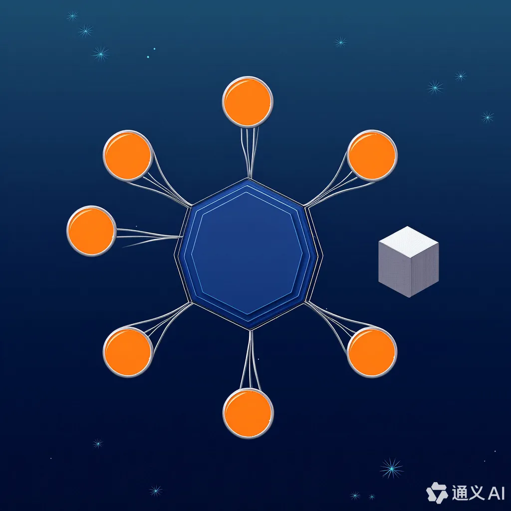

# 鹤之影 (hezhiying) @USTC

[中文](README_cn.md) | [English](README.md)

## About GitLab
Due to the network connectivity issues, the active development is mainly on [LUG GitLab](https://git.lug.ustc.edu.cn/hzyosh/lightrt). The path `lightrt` here is a copy of that Git repository.

## Team Members

-   [Weikang Wei](https://github.com/jianyingzhihe)
-   [Jiahong Luo](https://github.com/ustcljh)
-   [Zhuo Cui](https://github.com/crosaa)
-   [Yanzhen Guo](https://github.com/yzguo)

---

<h3 align="center">OSH-2025-hezhiying @University of Science and Technology of China</h3>

This is the GitHub homepage for the "鹤之影" (hezhiying) project, developed by students at the University of Science and Technology of China (USTC) for the OSH-2025 course. The project focuses on exploring topics related to operating systems, particularly in the context of embedded systems and microcontrollers.

&#160;
&#160;

&#160;

---

## Project Objectives

The goal of this project is to **design a distributed system based on a cluster of microcontrollers, interconnected via high-speed buses, utilizing shared RAM and a control core to achieve multitasking and multiprocess control**.

---

## Project Progress

|                                                   Project Stage                                                   |    Date    |                                                                        Progress                                                                         |                                                                                                                                                                                                                                                                                         Specific Tasks                                                                                                                                                                                                                                                                                         |                            Completion Status                            | Appendix                            |
|:-----------------------------------------------------------------------------------------------------------------:|:----------:|:-------------------------------------------------------------------------------------------------------------------------------------------------------:|:----------------------------------------------------------------------------------------------------------------------------------------------------------------------------------------------------------------------------------------------------------------------------------------------------------------------------------------------------------------------------------------------------------------------------------------------------------------------------------------------------------------------------------------------------------------------------------------------:|:-----------------------------------------------------------------------:|-------------------------------------|
|                                             Individual Topic Research                                             | 2025.3.16  |                                                                    Personal Research                                                                    |                                                                                                                          Zhuo Cui: Rewriting StarPU, a multi-core embedded OS for robots, in Rust; Yanzhen Guo: Lightweight customization and memory management optimization of Chromium kernel; Weikang Wei: Designing an OS for Internet of Things (IoT); Jiahong Luo: Designing an OS for scheduling multiple microcontrollers and achieving multitask processing                                                                                                                           |                                  Done                                   | [log1](./logs/March19-meeting.md)   |
|                                            Group Discussion on Topics                                             | 2025.3.19  |                                                                    Internal Exchange                                                                    | After discussion, we found that rewriting existing systems in Rust for standalone embedded systems on robots may not significantly improve performance and lacks novelty. Chromium's kernel is too large, making trimming or rewriting less effective. Combining IoT with fine-grained OS design to manage hardware resources precisely aligns well with resource scheduling on microcontrollers. We discussed MCU design aimed at running multiple programs on a single chip, then extending to N chips each running N programs, ultimately aiming to run more than N programs across N chips |                                  Done                                   | [log2](./logs/March19-meeting.md)   |
|                                              Determining Group Topic                                              | 2025.3.19  |                                                                     Topic Selection                                                                     |                                                                                                                                                                                                                                                                                 Planning the research roadmap                                                                                                                                                                                                                                                                                  |                                  Done                                   | [log3](./logs/March28-meeting.md)   |
|                                        Setting Up Experimental Environment                                        | 2025.3.28  |                                                                    Environment Setup                                                                    |                                                                                                                                                                                                                                                                   Jiahong Luo set up a basic experimental environment for us                                                                                                                                                                                                                                                                   |                                  Done                                   | [log4](./logs/March28-meeting.md)   |
| Confirmed a system design focused on optimizing memory management, task scheduling, and inter-chip communication. |  2025.4.2  |                                                                      Tech details                                                                       |                                                                                                                                                                                                         The meeting decided on a system design based on STM3F103 and GT6 processors, focusing on optimizing memory management, task scheduling, and inter-chip communication methods.                                                                                                                                                                                                          |                                  Done                                   | [log5](./logs/April2-meeting.md)    |
|                                      All APIs of the First Version Confirmed                                      |  2025.4.9  |                                                            API Confirmation and Code Writing                                                            |                                                                                                                                                                                                                                                          Each team member has selected ("claimed") a portion of the APIs to work on.                                                                                                                                                                                                                                                           | Discussions have been completed, but code writing is still in progress. | [log6](./logs/April9-meeting_en.md) |
|                                Revised communication protocol and hardware changes                                | 	2025.4.13 |                                                      	Modified the code for the communication part                                                      |                                                                                                                                                                                                                                       	After discussion, it was decided to adopt a new API to implement communication functionality through comm swtch.                                                                                                                                                                                                                                        |          	Discussion completed and corresponding code written           |                                     |
|                               Completed coding and refactoring of signal processing                               | 	2025.4.17 |                                                   	Adjusted and corrected the signal processing code                                                    |                                                                                                                                                                                                             	The team agreed on implementing three different communication methods and provided rich APIs for users to choose from, supporting three different waiting mechanisms.                                                                                                                                                                                                             |               	Discussion completed and code implemented                |                                     |
|                       Completed setting up new internal API versions and IO implementation                        | 	2025.4.23 | 	Conducted system space calls and specific hardware discussions	Separate discussions were held for the new version's user space and system space codes. |                                                                                                                                                                                                                                Waiting handling and specific IO implementations were enriched. A certain degree of code writing has been completed accordingly.                                                                                                                                                                                                                                |             	Discussions completed and partial code written             | [log7](./logs/April23-meeting.md)   |
| Completed the formulation of the new version code and further set up the remote testing platform to begin multi-threaded code testing for the actual STM32 program | 2025.5.11  | Conducted discussions on the deployment plan of the remote testing platform and performed in-depth analysis on the multi-threading mechanism for the STM32 hardware platform | Detailed design was carried out on system resource scheduling, thread priority allocation, and inter-task synchronization mechanisms, with initial validation of multi-threaded program stability in the remote testing environment | Finished the basic setup of the remote testing platform and implemented test case writing for part of the multi-threaded functionalities | |
| Clock Board Design Completed, Raspberry Pi Connected and Programs Can Be Uploaded via Raspberry Pi | 2025.5.18  | Hardware Design | Successfully completed the design of a hardware board based on real-time clock functionality, including circuit schematic drawing, PCB layout routing, component selection, and soldering. Also completed the communication interface (such as I2C or SPI) connection and debugging between the board and the Raspberry Pi to ensure stable and reliable data transmission. | Basic hardware functions completed |
| Clock Board Design and Fabrication Completed | 2022.5.22  | Clock Board | Successfully completed the design and fabrication of the Clock board based on an RTC (real-time clock) chip. The hardware has now passed initial power-on testing. | Completed |
| Interpreter's Low-Level Assembly Part Completed | 2025.6.10  | Software Development | The core low-level development of the assembly language interpreter has been completed, including the implementation of register simulation, memory access mechanisms, and the program counter. Integration and initial debugging with the hardware platform (Clock board) have also begun. | Low-level execution engine is basically ready|
| Board Development and Debugging Completed, Supporting Multi-Process Execution, Parallel Task Processing, and Distributed Problem Solving | 2025.6.20  | Hardware and System Development | Successfully completed the full development and debugging of the hardware board, implementing support for multi-process scheduling, parallel task execution, and a preliminary distributed task processing framework. The system can efficiently allocate computational tasks across multiple cores or nodes, significantly improving processing performance and suitability for complex real-time computing scenarios. | Supports Multi-Process and Distributed Processing |
---

## [Submit Issues](https://github.com/OSH-2025/hezhiying/issues/new)

## [Contact Us](#team-members)

Through [GitHub Issues](https://github.com/OSH-2025/hezhiying/issues/new) or [Email](#team-members)
