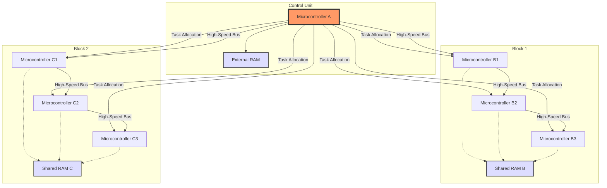

# 鹤之影 (hezhiying) @USTC  
[中文](README_cn.md) [英文](README)
<h3 align="center">OSH-2025-hezhiying @USTC</h3>

This is the GitHub homepage for the "鹤之影" (hezhiying) project, developed by students from the University of Science and Technology of China (USTC) for the OSH-2025 course. The project focuses on exploring topics related to operating systems, particularly in the context of embedded systems and single-chip microcomputers.

---

### 📦 version 
**v0.1.1** | Updated: 2025-03-23

---

## Team Members

- [jianyingzhihe](https://github.com/jianyingzhihe)  
- [罗嘉宏](https://github.com/ustcljh)  
- [崔卓](https://github.com/crosaa)  
- [郭彦禛](https://github.com/EricGuoYanzhen)  

---

## Project Progress

| Stage         | Task Details                                                                                                                                                                                                                                                                                                                                                                                                                                                                                                                                                                                                                                                                                                                                                                                                                                                                                                                                                                                                                                                                                                                                                                                                                                                                                                                                                                                                                                                                                                                                                                                                                                                                                                                                                        | Date     | Progress | Notes |
|---------------|---------------------------------------------------------------------------------------------------------------------------------------------------------------------------------------------------------------------------------------------------------------------------------------------------------------------------------------------------------------------------------------------------------------------------------------------------------------------------------------------------------------------------------------------------------------------------------------------------------------------------------------------------------------------------------------------------------------------------------------------------------------------------------------------------------------------------------------------------------------------------------------------------------------------------------------------------------------------------------------------------------------------------------------------------------------------------------------------------------------------------------------------------------------------------------------------------------------------------------------------------------------------------------------------------------------------------------------------------------------------------------------------------------------------------------------------------------------------------------------------------------------------------------------------------------------------------------------------------------------------------------------------------------------------------------------------------------------------------------------------------------------------|----------|----------|-------|
| Topic Selection | We had in-depth discussions around the topic of the big assignment. Firstly, we discussed the selection of underlying related content, such as multiprocessor systems or file systems, and mentioned the recently completed Linux 101 project. We believed that it could be expanded on this basis, but some people prefer the direction of combining with AI. However, after discussion, we believe that AI belongs to the application layer and is not closely related to the operating system, and we are concerned about insufficient innovation. Additionally, we explored the possibility of integrating the project with the Internet of Things (IoT), particularly focusing on resource scheduling and processing for multiple modules under a small memory footprint. This approach not only addresses performance issues on resource-constrained devices but also enhances system stability and efficiency, which is crucial for IoT devices.We have continued to consider previous year's titles and repo resources, but feel that simply copying them lacks novelty. We also proposed the embedded direction, believing that it can be combined with previously learned knowledge and has a stronger relevance to operating system courses. In order to better advance the project, we have decided to conduct research on the topics discussed today and will hold another meeting on Wednesday to discuss the feasibility of each direction and their specific implementation plans.                                                                                                                                                                                                                                                                  | March 16 | Done     |       |
| Topic Selection | We delved into the details of Internet of Things (IoT) fine-grained operating system design, focusing on optimizing operating system functionalities in resource-constrained environments to support efficient and stable operations. IoT devices often face limitations in processing power, memory space, and energy supply. Therefore, our design goal is to create an operating system capable of meticulously managing hardware resources, ensuring multitasking and data transmission can be achieved even under extreme conditions.Regarding the enhancement of StarPU's functionality, we considered using C/C++ to improve performance and compatibility instead of choosing the Rust language. While Rust offers better security guarantees, C/C++ is more suitable for certain specific hardware interfaces and legacy system compatibilities. Especially when direct hardware manipulation or higher execution efficiency is required, the advantages of C/C++ become more pronounced.Furthermore, we discussed the design of microcontroller units (MCUs), aiming to enable the capability of running multiple programs on a single chip, then scaling up to N chips each running N programs, and ultimately achieving a scenario where N chips run more than N programs. To further advance these concepts, we plan to conduct in-depth research on related technical details and will discuss the specific implementation strategies and technical challenges of each direction in the upcoming meetings. This includes, but is not limited to, evaluating the impact of different programming languages on project goals, exploring new algorithms suitable for IoT devices, and testing system performance across various hardware configurations. | March 19 | Done     |       |
| Preliminary Topic Selection| Process Scheduling on muti-Microcontrollers in Embedded Programming                                                                                                                                                                                                                                                                                                                                                                                                                                                                                                                                                                                                                                                                                                                                                                                                                                                                                                                                                                                                                                                                                                                                                                                                                                                                                                                                                                                                                                                                                                                                                                                                                                                                                                 |Month3 23|Done
eg. Subsequent working logs will be migrated to logs/.

---

## The project aims to:

### Design a distributed system based on a cluster of microcontrollers, connected through a high-speed bus. Utilize shared RAM and a control core to achieve multitasking and multiprocess control.
A schematic diagram is as follows:

---

## Project Operation Items
### 1. Hardware Selection
   - Microcontroller Choice:
       - It's recommended to use microcontrollers supporting high-speed communication interfaces, such as the STM32 series (supporting CAN, SPI, I2C, etc.), ESP32 (supporting Wi-Fi and multi-core), or NXP’s i.MX RT series.
       - The main controller needs higher computing power and memory management capabilities; models with MMU (Memory Management Unit) or at least support for RTOS are suggested.
   - High-Speed Bus:
       - SPI: Fast speed (tens of Mbps), suitable for short-distance communication, can be used for data exchange between master and slave controllers.
       - CAN: High reliability, suitable for industrial scenarios, supports multi-master and multi-slave architectures.
       - Ethernet: If higher bandwidth and scalability are needed, consider using an Ethernet controller (such as the W5500 chip paired with a microcontroller).
       - Custom Bus: For unmet requirements, custom high-speed communication protocols can be implemented based on FPGA.
   - Shared RAM:
       - Use external SRAM or DRAM chips (e.g., IS61LV25616AL from ISSI or DRAM from Micron), connected to the bus via FSMC (Flexible Static Memory Controller, commonly found in STM32) or similar interfaces.
       - The main controller manages RAM access through bus arbitration mechanisms (like semaphores or locks).
### 2. System Segmentation
   - Divide the microcontroller group into several "blocks", each block implementing data exchange through shared RAM, while the main controller is responsible for cross-block task scheduling.
   - Slave microcontrollers within each block can independently run subtasks, with tasks being distributed by the master and results collected.
   - Consider adopting a "master-slave" architecture, where the master acts as Master and slaves as Slaves.
### 3. Task Allocation and Multitasking Processing
   - Main Control Microcontroller: Runs a real-time operating system (RTOS, such as FreeRTOS or uC/OS-III), responsible for task scheduling, resource management, and communication protocol handling.
   - Slave Microcontrollers: Can run lightweight RTOS or bare-metal code, receiving and executing tasks assigned by the main controller.
   - Multiprocess Control: Implement process management similar to an operating system on the main controller, passing task parameters and results through shared RAM.
### 4. Communication Protocol
   - Define a simple communication protocol for task allocation and status feedback. Specifics will be determined later when the code is finalized.
   - Use interrupt mechanisms to improve communication efficiency and avoid wasting CPU resources due to polling.
---
## Implementation Steps
   ### (1) Hardware Connection
   - Connect the main control microcontroller to slave microcontrollers through SPI/I2C/CAN.
   - Connect shared RAM to all microcontrollers via FSMC or GPIO-simulated bus.
   - Add necessary power management and signal isolation (such as optocouplers or level shifters).
   ### (2) Software Design
   - Main Control Side:
       - Initialize RTOS, create a task scheduler.
       - Implement bus communication drivers (such as SPI driver).
       - Design a task allocation algorithm (for example, based on priority or load balancing).
   - Slave Side:
       - Initialize communication interface, listen for instructions from the main controller.
       - Execute assigned tasks and return results through shared RAM.
   - Shared RAM Management:
       - Implement a simple memory allocation table to record the RAM usage of each block.
       - Use mutexes to prevent data races.
---
## References

### **[FreeRTOS](https://github.com/FreeRTOS)**
- **Introduction**: FreeRTOS is a very popular open-source real-time operating system widely used in various embedded systems, including STM32 microcontrollers.
- **Features**:
  - Supports task management, semaphores, queues, and more.
  - Optimized for resource-constrained devices.
  - Offers extensive documentation and community support.
  - **STM32 Support**: FreeRTOS officially provides good support for STM32, and the STM32CubeMX tool integrates FreeRTOS configuration options, facilitating rapid development.

### **[Zephyr Project](https://github.com/zephyrproject-rtos/zephyr)**
- **Introduction**: Zephyr is a scalable small real-time operating system suitable for resource-constrained devices and IoT applications.
- **Features**:
  - Supports multiple architectures, including ARM Cortex-M.
  - Built-in support for various wireless technologies such as Bluetooth and Wi-Fi.
  - Strong security features and continuous integration testing.
  - **STM32 Support**: Zephyr provides excellent support for STM32 series microcontrollers, making it suitable for applications requiring complex network functionalities.

### **[ThreadX](https://github.com/RISCV-on-Microsemi-FPGA/ThreadX)**
- **Introduction**: ThreadX is a commercial RTOS known for its high performance and ease of use.
- **Features**:
  - Extremely low interrupt latency and fast task switching.
  - Includes middleware components such as file systems and USB support.
  - Provides detailed documentation and technical support.
  - **STM32 Support**: ThreadX supports the STM32 platform and can be used for free in certain scenarios.

### **[CMSIS-RTOS](https://github.com/ARM-software/CMSIS-FreeRTOS.git)**
- **Introduction**: CMSIS-RTOS V2 is a standard API provided by ARM to simplify the porting of RTOS across different embedded systems.
- **Features**:
  - Standardized APIs make code easier to port.
  - Supports the latest ARM architectures.
  - Seamlessly integrates with Keil MDK.
  - **STM32 Support**: CMSIS-RTOS V2 is designed for ARM architectures and thus naturally supports STM32 series microcontrollers.

This structured reference section outlines key features and support details for each of the mentioned RTOS options, providing clear guidance for selecting the most appropriate system for your STM32-based projects.

---
## Control Options  

- **[Expand Progress Table](#project-progress)** - View project progress details  
- **[Jump to the top](#鹤之影-hezhiying-ustc)** - Jump to the top 
- **[View source code](https://github.com/hezhiying-ustc/OSH-2025-hezhiying/tree/main/src)** - View source code 
- **[Submit Issues](https://github.com/hezhiying-ustc/OSH-2025-hezhiying/issues/new)** - Report bugs or suggestions 

---

## Group Logo

  
*永世传颂，不休独舞，神爱世人，芙门永存！*  

---

## Additional Info

- **Current version**: v0.1.1 
- **Update Log**:  
  - v0.1.0 (2025-03-22): Initialize the project homepage, add team information and preliminary progress.
  - v0.1.1 (2025-03-23): Preliminary project objectives were determined, and the project requirements and key factors were analyzed in detail
- **contact us**:  GitHub Issues or email ([click here and jump to us](#team-members)) 
