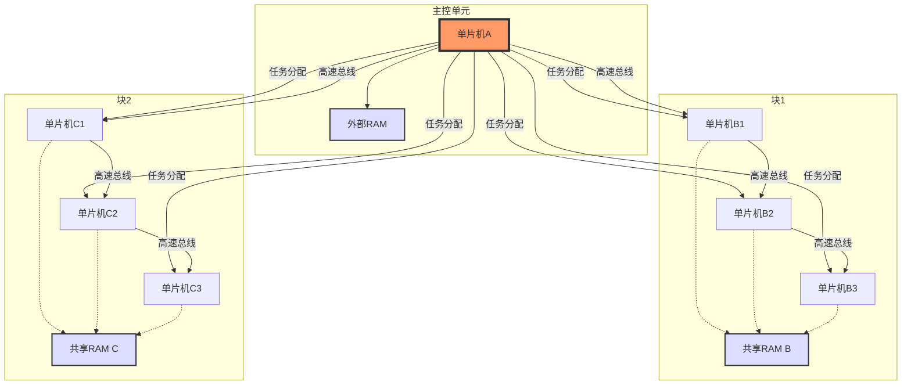

# 鹤之影 (hezhiying) @USTC
[中文](README_cn.md) [英文](README.md)

<h3 align="center">OSH-2025-鹤之影 @中国科学技术大学</h3>

这是“鹤之影”(hezhiying)项目的GitHub主页，该项目由中国科学技术大学（USTC）的学生为OSH-2025课程开发。项目专注于探索与操作系统相关的主题，特别是在嵌入式系统和单片机的背景下。

&#160;
&#160;
    
&#160;

---

### 📦 当前版本
**v0.1.1** | 更新时间: 2025-03-23

---

## 团队成员

- [位文康](https://github.com/jianyingzhihe)
- [罗嘉宏](https://github.com/ustcljh)
- [崔卓](https://github.com/crosaa)
- [郭彦禛](https://github.com/EricGuoYanzhen)

---

## 项目进度

| 阶段       | 任务详情                                                                                                                                                                                                                                                                                                                                                                                                                                                                                         | 日期   | 完成情况 | 附录 |
|----------|----------------------------------------------------------------------------------------------------------------------------------------------------------------------------------------------------------------------------------------------------------------------------------------------------------------------------------------------------------------------------------------------------------------------------------------------------------------------------------------------|------|------|----|
| 课题选择     | 我们围绕大作业的主题进行了深入讨论。首先，我们讨论了底层相关内容的选择，比如多处理器系统或文件系统，并提到了最近完成的Linux 101项目。我们认为可以在该项目的基础上进行扩展，但有些人倾向于结合人工智能的方向。然而，在讨论之后，我们认为人工智能属于应用层，并与操作系统没有紧密的联系，同时我们也担心这方面的创新不足。此外，我们探讨了将项目与物联网（IoT）相结合的可能性，特别是关注在小内存环境下多个模块的资源调度和处理。这种方法不仅解决了资源受限设备上的性能问题，还增强了系统的稳定性和效率，这对物联网设备至关重要。我们继续考虑了往年的题目和仓库资源，但感觉单纯地复制它们缺乏新颖性。我们提出了嵌入式方向，认为它可以与之前学习的知识相结合，且与操作系统课程有更强的相关性。为了更好地推进项目，我们决定对今天讨论的主题进行研究，并定于周三再次开会详细讨论各个方向的可行性及其具体实施方案。                                                                                 | 3.16 | 完成   |    |
| 课题选择以及讨论 | 我们深入探讨了物联网（IoT）细粒度操作系统设计的细节，重点在于优化资源受限环境下的操作系统功能，以支持高效和稳定的运行。物联网设备通常面临处理能力、内存空间和能源供应的限制。因此，我们的设计目标是创建一个能够精细管理硬件资源的操作系统，确保即使在极端条件下也能实现多任务处理和数据传输。关于增强StarPU的功能性，我们考虑使用C/C++来提高性能和兼容性，而不是选择Rust语言。虽然Rust提供了更好的安全性保障，但在某些特定的硬件接口和遗留系统的兼容性方面，C/C++更为合适。特别是在需要直接操作硬件或追求更高执行效率时，C/C++的优势更加明显。此外，我们讨论了微控制器单元（MCU）的设计方案，旨在实现在单一芯片上运行多个程序的能力，然后扩展到N个芯片分别运行N个程序，最终达到N个芯片运行超过N个程序的目标。为了进一步推进这些概念，我们计划深入研究相关技术细节，并将在即将举行的会议中详细讨论每个方向的具体实施策略和技术挑战。这包括但不限于评估不同编程语言对项目目标的影响、探索适用于物联网设备的新算法以及测试各种硬件配置下的系统性能。 | 3.19 | 完成   |    |
| 初步确定选题   | 嵌入式编程中的单片机集群多进程调度                                                                                                                                                                                                                                                                                                                                                                                                                                                                            | 3.23 | 完成   |    |

此后工作日志迁移至./logs/ 目录下。

---

## 项目目标

项目旨在：
### 设计一个基于单片机集群的分布式系统，通过高速总线连接多个单片机，并利用共享RAM和一个控制核心来实现多任务处理和多进程控制。
示意图大概如下：

---
## 项目操作事项
### 1.硬件选择
- 单片机选择:
  - 推荐使用支持高速通信接口的单片机，例如STM32系列（支持CAN、SPI、I2C等高速总线）、ESP32（支持Wi-Fi和多核）、或者NXP的i.MX RT系列。
  - 主控单片机需要较高的计算能力和内存管理能力，建议选择带MMU（内存管理单元）或至少支持RTOS的型号。
- 高速总线:
  - SPI: 速度快（几十Mbps），适合短距离通信，可用于主控与从控之间的数据交换。
  - CAN: 可靠性高，适合工业场景，支持多主多从架构。
  - Ethernet: 如果需要更高带宽和扩展性，可以考虑以太网控制器（如W5500芯片配合单片机）。
  - 自定义总线: 如果现有总线不满足需求，可以基于FPGA实现自定义高速通信协议。
- 共享RAM:
  - 使用外部SRAM或DRAM芯片（如ISSI的IS61LV25616AL或Micron的DRAM），通过FSMC（灵活静态存储器控制器，常见于STM32）或类似接口连接到总线。
  - 主控单片机通过总线仲裁机制（如信号量或锁）管理RAM访问。
###  2.系统分块
- 将单片机群分为若干“块”，每个块内通过共享RAM实现数据交换，主控单片机负责跨块任务调度。
- 每个块内的从控单片机可以独立运行子任务，主控通过总线分发任务并收集结果。
- 考虑使用“主-从”架构，主控为Master，从控为Slave。
### 3.任务分配与多任务处理
- 主控单片机: 运行实时操作系统（RTOS，如FreeRTOS或uC/OS-III），负责任务调度、资源管理和通信协议。
- 从控单片机: 可以运行轻量级RTOS或裸机代码，接收主控分配的任务并执行。
- 多进程控制: 在主控上实现类似操作系统的进程管理，通过共享RAM传递任务参数和结果。
### 4.通信协议
- 定义一个简单的通信协议，用于任务分配和状态反馈。具体待定，等到具体完成代码时再商议。
- 使用中断机制提高通信效率，避免轮询浪费CPU资源。
## 具体实现步骤
### (1)硬件连接
- 主控单片机通过SPI/I2C/CAN连接到从控单片机。
- 共享RAM通过FSMC或GPIO模拟总线连接到所有单片机。
- 添加必要的电源管理和信号隔离（如光耦或电平转换器）。
### (2) 软件设计
- 主控端:
  - 初始化RTOS，创建任务调度器。
  - 实现总线通信驱动（如SPI驱动）。
  - 设计任务分配算法（例如基于优先级或负载均衡）。
- 从控端:
  - 初始化通信接口，监听主控指令。
  - 执行分配的任务并通过共享RAM返回结果。
- 共享RAM管理:
  - 实现简单的内存分配表，记录每个块的RAM使用情况。
  - 使用互斥锁防止数据竞争。

---

## 部分参考文档
### **[FreeRTOS](https://github.com/FreeRTOS)**
- 简介: FreeRTOS 是一个非常流行的开源实时操作系统，广泛应用于各种嵌入式系统中，包括STM32微控制器。
- 特点:
  - 支持任务管理、信号量、队列等功能。
  - 对资源受限设备进行了优化。
  - 提供了丰富的文档和支持社区。
  - STM32支持: FreeRTOS 官方提供了对 STM32 的良好支持，并且在 STM32CubeMX 工具中集成了 FreeRTOS 配置选项，便于快速开发。
###  **[Zephyr Project](https://github.com/zephyrproject-rtos/zephyr)**
- 简介: Zephyr 是一个可扩展的小型实时操作系统，适用于资源受限设备和物联网应用。
- 特点:
  - 支持多种架构，包括 ARM Cortex-M。
  - 内置对蓝牙、Wi-Fi等多种无线技术的支持。
  - 强大的安全特性和持续集成测试。
  - STM32支持: Zephyr 对 STM32 系列微控制器提供了良好的支持，适合需要复杂网络功能的应用场景。
###  **[ThreadX](https://github.com/RISCV-on-Microsemi-FPGA/ThreadX)**
- 简介: ThreadX 是一个商业RTOS，以其高性能和易用性著称。
- 特点:
  - 极低的中断延迟和快速的任务切换。
  - 包含文件系统、USB支持等多个中间件组件。
  - 提供详细的文档和技术支持。
  - STM32支持: ThreadX 支持 STM32 平台，并且在某些情况下可以免费使用。
###    **[CMSIS-RTOS](https://github.com/ARM-software/CMSIS-FreeRTOS.git)**
- 简介: CMSIS-RTOS V2是一个由ARM提供的标准API，旨在简化RTOS在不同嵌入式系统的移植。
- 特点:
  - 标准化的API使得代码更易于移植。
  - 支持最新的ARM架构。
  - 可以与Keil MDK无缝集成。
  STM32支持: CMSIS-RTOS V2专为ARM架构设计，因此自然支持STM32系列微控制器。

---
## 控制选项

- **[展开进度表格](#project-progress)** - 查看项目进度详情
- **[跳转到顶部](#鹤之影-hezhiying-ustc)** - 返回页面顶部
- **[查看源代码](https://github.com/hezhiying-ustc/OSH-2025-hezhiying/tree/main/src)** - 浏览项目代码
- **[提交问题](https://github.com/hezhiying-ustc/OSH-2025-hezhiying/issues/new)** - 报告 bug 或建议

---

## 团队 Logo 

  
*永世传颂，不休独舞，神爱世人，芙门永存！*

---

## 附加信息

- **当前版本**: v0.1.1
- **更新日志**:
    - v0.1.0 (2025-03-22): 初始化项目主页，添加团队信息和初步进度。
    - v0.1.1(2025-03-23):初步确定项目目标，并详细分析了项目的需求以及关键
- **[联系我们](#团队成员)**: 通过 GitHub Issues 或邮件 ([点击这里找到我们](#团队成员))
