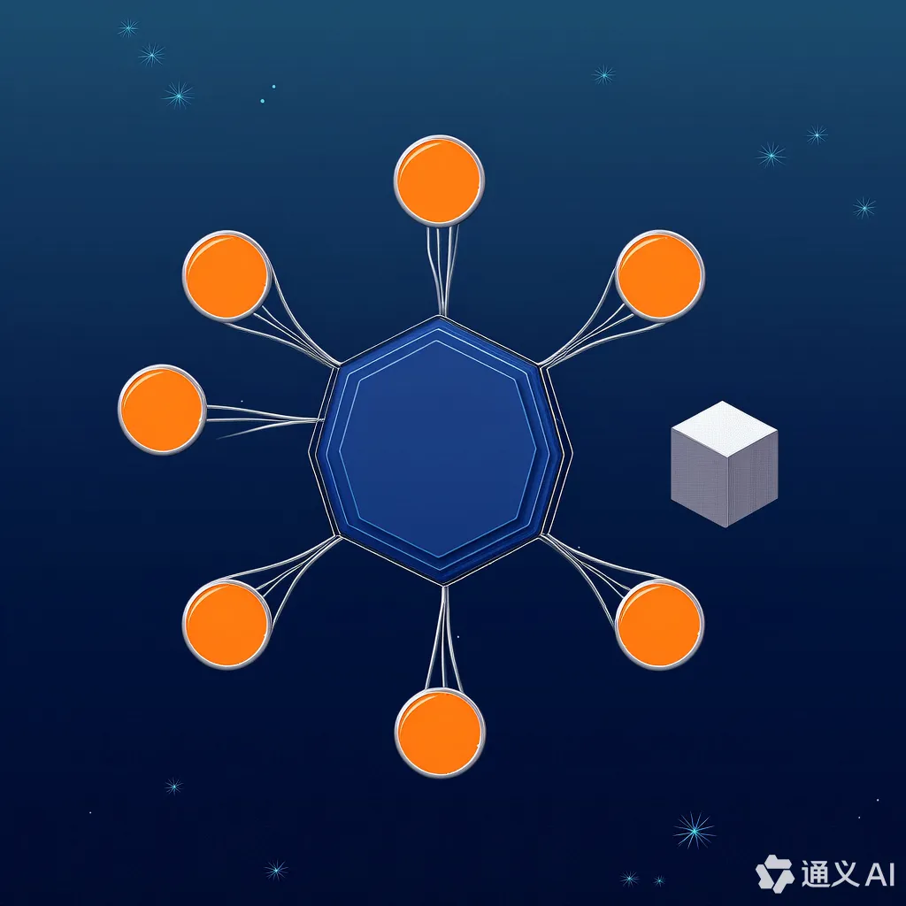

# 鹤之影 (hezhiying) @USTC

[中文](README_cn.md) | [English](README.md)

## 项目成员

-   [位文康](https://github.com/jianyingzhihe)
-   [罗嘉宏](https://github.com/ustcljh)
-   [崔卓](https://github.com/crosaa)
-   [郭彦禛](https://github.com/yzguo)

---

<h3 align="center">OSH-2025-鹤之影 @中国科学技术大学</h3>

这是“鹤之影” (hezhiying)项目的 GitHub 主页，该项目由中国科学技术大学（USTC）的学生为 OSH-2025 课程开发。项目专注于探索与操作系统相关的主题，特别是在嵌入式系统和单片机的背景下。

&#160;
&#160;

&#160;

---

## 项目目标

本项目旨在：**设计一个基于单片机集群的分布式系统，通过高速总线连接多个单片机，并利用共享 RAM 和一个控制核心来实现多任务处理和多进程控制**。

---

## 项目进度

|            项目阶段             |    日期     |        项目进展         |                                                                                                                        具体分工                                                                                                                         |       完成情况        | 附录                                |
|:---------------------------:|:---------:|:-------------------:|:---------------------------------------------------------------------------------------------------------------------------------------------------------------------------------------------------------------------------------------------------:|:-----------------:| ----------------------------------- |
|           个人选题调研            | 2025.3.16 |        个人调研         |                                                                    崔卓：机器人上的多核嵌入式操作系统 StarPU 的 Rust 复写；郭彦禛：Chromium 内核轻量化定制与内存管理优化；位文康：物联网 IoT 的操作系统设计；罗嘉宏：多个单片机调度、实现多任务处理的操作系统设计                                                                    |        已完成        | [log1](./logs/March19-meeting_cn.md) |
|           个人选题交流            | 2025.3.19 |        组内交流         | 经过讨论，我们认为对于机器人上的独立嵌入式系统，用 Rust 复写并不利于系统性能的提升，而且 Rust 对于已有操作系统的复写缺乏新颖性。Chromium 内核过于庞大，进行裁剪或重写的效果可能不够理想。而结合 IoT 的细粒度操作系统设计，实现一个能够精细管理硬件资源的操作系统，这点与单片机上的资源调度有较高的契合性。我们讨论了 MCU 的设计方案，旨在实现在单一芯片上运行多个程序的能力，然后扩展到 N 个芯片分别运行 N 个程序，最终达到 N 个芯片运行超过 N 个程序的目标 |        已完成        | [log2](./logs/March19-meeting_cn.md) |
|           确定小组选题            | 2025.3.19 |        确定选题         |                                                                                                                       规划了课题路线                                                                                                                       |        已完成        | [log3](./logs/March28-meeting_cn.md) |
|           实验环境搭建            | 2025.3.28 |        环境搭建         |                                                                                                                罗嘉宏同学为我们搭建了一个基本的实验环境                                                                                                                 |        已完成        | [log4](./logs/March28-meeting_cn.md) |
| 确定了优化内存管理、任务调度及芯片间通信的系统设计方案 | 2025.4.2  |        技术细节         |                                                                                               决定了基于 STM3F103 和 GT6 处理器的系统设计，重点在于优化内存管理、任务调度及芯片间通信方法。                                                                                                |        已完成        | [log5](./logs/April2-meeting_cn.md) |
|       确定了第一版本的所有 api        | 2025.4.9  |    api 确认以及代码编写     |                                                                                                                  每个人认领部分 api 进行编写                                                                                                                   |   已完成讨论，未完成代码编写   | [log6](./logs/April9-meeting_cn.md) |
|      更改了通信部分的协议以及硬件更改       | 2025.4.13 |     更改通信部分代码的编写     |                                                                                                          经过讨论更改了通信部分api，转为通过comm swtch 来实现                                                                                                          | 完成讨论并完成对应通讯部分代码编写 ||
|      完成了信号部分代码的编写以及重构       | 2025.4.17 | 更改了信号部分代码并修正了其实现的方式 |                                                                                               经讨论，将通信部分的代码实现三种不同的方式来进行实现，并提供给用户足够的api可以调用三种不同的对应等待方式                                                                                                | 完成了讨论并实现了代码的编写||
|   完成了新版本内部api的设定并进行了IO的实现   | 2025.4.23 |  进行了系统空间调用以及具体硬件讨论  |                                                                                                  对新版本用户空间和系统空间的代码进行了分开的讨论并通过更丰富的方式实现了等待的处理和IO的具体实现                                                                                                  |完成了讨论并一定程度上完成了代码的编写|[log7](./logs/April23-meeting.md)|
| 完成新版本代码的制定，并开始进一步搭建远程测试平台，启动对STM32实际程序的多线程代码测试 | 2025.5.11 | 开展了关于远程测试平台的具体部署方案讨论，并针对STM32硬件平台的多线程运行机制进行了深入分析 |                                                                                              对系统资源调度、线程优先级分配以及任务间的同步机制进行了详细设计，并在远程测试环境中初步验证了多线程程序的稳定性                                                                                               | 完成了远程测试平台的基础搭建，并实现了部分多线程功能的测试用例编写 |  |
|时钟板子设计完成，树莓派连接好，可以通过树莓派刷程序| 2025.5.18 |硬件设计|                                                                       成功完成了基于实时时钟功能的硬件板子设计，包括电路原理图绘制、PCB 布局布线以及元器件选型与焊接。同时完成了该板子与树莓派之间的通信接口（如 I2C 或 SPI）连接调试，确保两者之间数据传输稳定可靠。                                                                        |完成了基础硬件功能||
|Clock 板子设计与制作完成| 2022.5.22 |Clock 板子|                                                                                                  成功完成了基于 RTC（实时时钟）芯片的 Clock 板子设计与制作。目前硬件已通过初步通电测试。                                                                                                  |完成||
| 解释器的底层汇编部分完成 | 2025.6.29 | 软件开发 |                                                                                   完成了汇编语言解释器底层核心功能的开发，包括对寄存器模拟、内存访问机制以及程序计数器的实现。开始与硬件平台（ Clock 板子）进行联合调试。                                                                                    | 底层执行引擎基本就绪 
| 完成板子的开发调试，包括运行多进程，并行进行任务，分布式处理问题 | 2025.6.20 | 硬件与系统开发 | 成功完成了硬件板子的全部开发与调试工作，实现了对多进程调度的支持，具备并行执行任务的能力，并初步构建了分布式任务处理框架。该系统能够在多个核心或节点之间合理分配计算任务，显著提升处理效率，适用于复杂实时计算场景。| 支持多进程与分布式处理 |
---

## [提交问题](https://github.com/OSH-2025/hezhiying/issues/new)

## [联系我们](#项目成员)

通过 [GitHub Issues](https://github.com/OSH-2025/hezhiying/issues/new) 或 [邮件](#项目成员)
