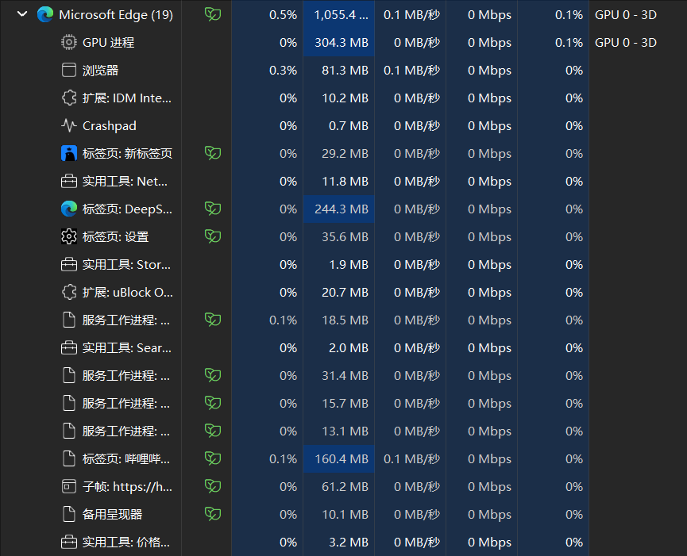

# OSH 前期个人调研报告
[中文](investigation_cn.md) [英文](investigation.md)
## Chromium 内核轻量化定制与内存管理优化

### 一、 构思来源

- 每次看到任务管理器里面edge庞大的进程数与内存占用都令人望而生畏，因此萌生了裁剪与重写chromium内核的想法

    

### 二、 任务分析

1. Chromium 内核的轻量化定制通常有两个步骤：

- 裁剪现有模块：移除非核心功能（如 WebRTC、PDF 阅读器、媒体播放器等），通过修改 `gn` 构建文件禁用或删除相关代码模块。

- 重写部分组件：对进程管理、内存优化、渲染流程等方面进行代码重构。

1. 任务概览

   - 通过编译参数禁用非核心模块，快速减少代码体积。

        - 步骤举例：

            修改 `args.gn` 文件：在 `src/out/Default` 目录下创建或编辑 `args.gn`，添加裁剪参数：
            ```gn
            enable_pdf = false
            enable_webrtc = false
            enable_extensions = false
            enable_printing = false
            ```

            生成构建配置：
            ```bash
            gn gen out/Default
            ```

            编译并验证：
            ```bash
            autoninja -C out/Default chrome
            ```

    - 修改源码实现进程数限制和内存管理优化

        - 步骤举例：

            - 减少进程数：修改 `src/content/public/common/content_switches.cc`，添加进程数限制参数：
                ```cpp
                const char kRendererProcessLimit[] = "--renderer-process-limit=4";
                ```
                在 `src/chrome/browser/chrome_main.cc` 中注入命令行参数：
                ```cpp
                command_line->AppendSwitchASCII(switches::kRendererProcessLimit, "4");
                ```

            - 优化内存分配：修改 `src/base/allocator/partition_allocator/partition_alloc_config.h`，调整内存池大小：
                ```cpp
                #define PA_THREAD_CACHE_SIZE_KB 128
                ```

    - 功能验证与调试

        - 功能测试：

            使用 Web Platform Tests 验证 Web 标准兼容性。

        - 性能测试：

            内存占用：对比裁剪前后 `chrome://memory` 数据。
            进程数：通过 `chrome://process-internals` 检查实际进程数。

        - 调试工具：

            使用 `gdb`/`lldb` 调试崩溃问题。
            通过 `chrome://tracing` 分析性能瓶颈。

2. 工具

    - `chrome://net-internals`：网络请求分析。
    - `chrome://blink-internals`：Blink 引擎状态监控。

### 三、 工作量与可行性分析

- AI告诉我说至少2000行代码以上，确实有些庞大了hhh，这个计划一提出来就被否了，有点难绷，主要是读代码真的是一项极其艰苦的工作，再改的话就更麻烦了。
