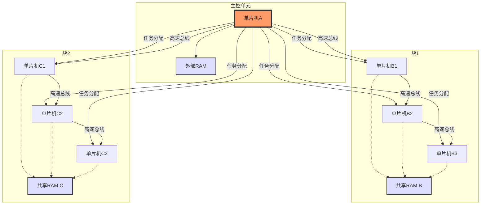

# 关于多单片机多进程的调研报告
[中文](readme，md) [英文](readme_en.md)

---

## 1. 研究背景

操作系统是计算机系统的核心组成部分，负责管理硬件资源、协调任务执行并提供用户与硬件之间的接口。在传统桌面和服务器环境中，操作系统设计已相对成熟，但在嵌入式系统领域，尤其是资源受限的物联网（IoT）和单片机集群场景中，操作系统的设计仍面临诸多挑战。随着物联网设备的普及，低功耗、小内存、高可靠性的系统需求日益增加，这推动了嵌入式操作系统研究的快速发展。

当前，嵌入式系统广泛应用于智能家居、工业自动化、医疗设备等领域，而单片机集群的分布式设计能够突破单一芯片的性能瓶颈，提升系统整体的计算能力和稳定性。因此，本项目的研究不仅是对操作系统课程知识的实践延伸，也顺应了嵌入式技术发展的趋势。

---

## 2.立项依据

### 课程需求与知识衔接

OSH课程旨在帮助我们掌握操作系统的核心原理，所以我们团队在选题讨论中紧密结合这一特点，同时结合嵌入式系统的特点。单片机集群多进程调度的选题与课程内容（如进程管理、内存分配、通信机制）高度相关，能够有效巩固理论知识。

### 思路来源

我们讨论到关于在实现机器人控制领域，他们目前很需要一种技术去同步实现多个进程的实现，而不是分时间顺序或者同步地进行进程的运行，而且目前已有的机器人操作系统都是单核心的，我们目的是设计一个多核心的，提高效率。

### 技术挑战与创新性

相较于传统单片机单一任务执行，集群化设计引入了多进程调度和资源共享的复杂性。
### 物联网应用的实际需求

物联网设备通常运行在资源受限环境下（如小内存、低功耗），需要操作系统支持高效的多任务处理和数据交换。我们通过单片机集群和共享RAM的设计，探索在小规模硬件上的分布式系统实现，为物联网设备的性能优化提供了新思路。

---

## 3.理论知识

### 进程与调度

**进程管理**：进程状态（就绪、运行、阻塞）、上下文切换、进程间通信（IPC）。**调度算法**：优先级调度、轮转调度、多级反馈队列，用于任务分配和负载均衡。**多任务处理**：在资源受限的单片机上实现多进程并行运行。

### 内存管理

**共享内存**：通过外部RAM实现数据共享，涉及内存分配表和访问控制（如互斥锁）。**内存仲裁**：主控与从控单片机对共享RAM的竞争管理。**轻量化设计**：针对小内存环境优化内存使用效率。

### 通信机制

**高速总线**：SPI、I2C、CAN 等通信协议的基本原理和性能特点。**中断机制**：利用硬件中断提高通信效率，避免轮询浪费资源。**协议设计**：自定义通信协议，用于任务分发和状态反馈。

### 嵌入式系统设计

**硬件接口**：单片机与外部RAM、总线的连接方式。**分布式架构**：主-从模型和集群化设计的实现原理。

这些理论为项目的硬件选型、系统架构和软件设计提供了坚实支撑。

---

## 4.实验目的

### 探索分布式系统设计

在单片机集群中实现任务分配和数据共享，探索分布式系统在小规模硬件上的实现方法，为物联网设备提供参考。

### 优化系统性能

通过实验比较不同调度策略和通信协议的效果，优化系统在资源受限环境下的效率和稳定性。
示意图大概如下：

---

## 5.运行环境

根据项目需求，运行环境分为硬件和软件两部分：

### 1.硬件选择
- 单片机选择:
    - 推荐使用支持高速通信接口的单片机，例如STM32系列（支持CAN、SPI、I2C等高速总线）、ESP32（支持Wi-Fi和多核）、或者NXP的i.MX RT系列。
    - 主控单片机需要较高的计算能力和内存管理能力，建议选择带MMU（内存管理单元）或至少支持RTOS的型号。
- 高速总线:
    - SPI: 速度快（几十Mbps），适合短距离通信，可用于主控与从控之间的数据交换。
    - CAN: 可靠性高，适合工业场景，支持多主多从架构。
    - Ethernet: 如果需要更高带宽和扩展性，可以考虑以太网控制器（如W5500芯片配合单片机）。
    - 自定义总线: 如果现有总线不满足需求，可以基于FPGA实现自定义高速通信协议。
- 共享RAM:
    - 使用外部SRAM或DRAM芯片（如ISSI的IS61LV25616AL或Micron的DRAM），通过FSMC（灵活静态存储器控制器，常见于STM32）或类似接口连接到总线。
    - 主控单片机通过总线仲裁机制（如信号量或锁）管理RAM访问。
###  2.系统分块
- 将单片机群分为若干“块”，每个块内通过共享RAM实现数据交换，主控单片机负责跨块任务调度。
- 每个块内的从控单片机可以独立运行子任务，主控通过总线分发任务并收集结果。
- 考虑使用“主-从”架构，主控为Master，从控为Slave。
### 3.任务分配与多任务处理
- 主控单片机: 运行实时操作系统（RTOS，如FreeRTOS或uC/OS-III），负责任务调度、资源管理和通信协议。
- 从控单片机: 可以运行轻量级RTOS或裸机代码，接收主控分配的任务并执行。
- 多进程控制: 在主控上实现类似操作系统的进程管理，通过共享RAM传递任务参数和结果。
### 4.通信协议
- 定义一个简单的通信协议，用于任务分配和状态反馈。具体待定，等到具体完成代码时再商议。
- 使用中断机制提高通信效率，避免轮询浪费CPU资源。

---

## 6.具体实现步骤
### (1)硬件连接:我们组设计了一款PCB板子，通过先将所有的单片机与板子相连，然后板子之间进行通信，从而大大增加了通信速度，比传统杜邦线速度快很多。
### (2) 软件设计
- 主控端:
    - 初始化RTOS，创建任务调度器。
    - 实现总线通信驱动（如SPI驱动）。
    - 设计任务分配算法（例如基于优先级或负载均衡）。
- 从控端:
    - 初始化通信接口，监听主控指令。
    - 执行分配的任务并通过共享RAM返回结果。
- 共享RAM管理:
    - 实现简单的内存分配表，记录每个块的RAM使用情况。
    - 使用互斥锁防止数据竞争。

---

## 7.重要性分析

### 学术价值

项目主要集中于区别于别人工作的，在多个芯片而非多核的情况下的多进程调度，并且我们想完成一个os on stm32 ，来实现一个简单易调用的库结构，给别儿留下一个方便的多进程任务接口。

### 技术意义

单片机集群的设计突破了单一芯片的性能限制，通过硬件协同和软件优化提升了系统能力。这种方法在物联网、边缘计算等领域具有潜在应用价值。同时方便了任务的调度和多个芯片资源的分配，

---

## 8.相关工作调查

### 经典嵌入式操作系统
## 部分参考文档
### **[FreeRTOS](https://github.com/FreeRTOS)**
- 简介: FreeRTOS 是一个非常流行的开源实时操作系统，广泛应用于各种嵌入式系统中，包括STM32微控制器。
- **参考价值**：项目可直接使用其调度器和通信机制。**不足**：缺乏分布式支持，需自行扩展。
- 特点:
  - 支持任务管理、信号量、队列等功能。
  - 对资源受限设备进行了优化。
  - 提供了丰富的文档和支持社区。
  - STM32支持: FreeRTOS 官方提供了对 STM32 的良好支持，并且在 STM32CubeMX 工具中集成了 FreeRTOS 配置选项，便于快速开发。
###  **[Zephyr Project](https://github.com/zephyrproject-rtos/zephyr)**
- 简介: Zephyr 是一个可扩展的小型实时操作系统，适用于资源受限设备和物联网应用。
- **参考价值**：提供集群通信的灵感，但过于复杂，不适合小规模单片机。
- 特点:
  - 支持多种架构，包括 ARM Cortex-M。
  - 内置对蓝牙、Wi-Fi等多种无线技术的支持。
  - 强大的安全特性和持续集成测试。
  - STM32支持: Zephyr 对 STM32 系列微控制器提供了良好的支持，适合需要复杂网络功能的应用场景。
###  **[ThreadX](https://github.com/RISCV-on-Microsemi-FPGA/ThreadX)**
- 简介: ThreadX 是一个商业RTOS，以其高性能和易用性著称。
- 特点:
  - 极低的中断延迟和快速的任务切换。
  - 包含文件系统、USB支持等多个中间件组件。
  - 提供详细的文档和技术支持。
  - STM32支持: ThreadX 支持 STM32 平台，并且在某些情况下可以免费使用。
###    **[CMSIS-RTOS](https://github.com/ARM-software/CMSIS-FreeRTOS.git)**
- 简介: CMSIS-RTOS V2是一个由ARM提供的标准API，旨在简化RTOS在不同嵌入式系统的移植。
- 特点:
  - 标准化的API使得代码更易于移植。
  - 支持最新的ARM架构。
  - 可以与Keil MDK无缝集成。
    STM32支持: CMSIS-RTOS V2专为ARM架构设计，因此自然支持STM32系列微控制器。

### 单片机集群研究

**StarPU**

**简介**：一个任务调度框架，支持异构多核系统。**启示**：项目考虑扩展StarPU 的核心数。

**MPICH on MCU**

**简介**：微控制器上的消息传递接口实现，用于集群通信。**启示**：可借鉴其通信协议设计，但需精简以适配资源受限环境。

### 往年项目案例

- **OSH-2019 项目**
      - **内容**：基于单片机的简单操作系统实现。
      - **启示**：提供硬件选型和基础代码参考，但缺乏集群化设计。
- **VR-fancy-office (OSH-2022)**
  - **内容**：基于 Oculus Quest 2 的嵌入式系统。
  - **启示**：展示了嵌入式系统与应用的结合，但与本项目方向不同。

### 本项目创新点

过往的所有项目都是集中于单芯片多核或者单芯片单核下的多任务处理，本项目提出集群化设计，通过高速总线和共享RAM实现分布式多进程调度，从而实现在多个不同的芯片下的多进程调度的功能。针对物联网场景优化，兼顾性能与资源限制，具有较强的应用导向性。结合主-从架构和轻量化RTOS，探索小规模硬件上的系统级设计。

---

## 9.关键引文

- **[Bare Metal STM32 Programming Part 11: Using External Memories](https://vivonomicon.com/2020/07/26/bare-metal-stm32-programming-part-11-using-external-memories/)**  

- **[Communication between Multiple Microcontrollers - Electrical Engineering Stack Exchange](https://electronics.stackexchange.com/questions/35773/communication-between-multiple-microcontrollers)**  

- **[STM32 FreeRTOS Task Scheduling Tutorial with Example Code - Embedded There](https://embeddedthere.com/stm32-freertos-task-scheduling-tutorial/)**  

- **[Distributed Operating System - Wikipedia](https://en.wikipedia.org/wiki/Distributed_operating_system)**  

- **[Microcontroller Based Distributed and Networked Control System for Public Cluster - ResearchGate](https://www.researchgate.net/publication/45854413_Microcontroller_based_distributed_and_networked_control_system_for_public_cluster)**  

- **[A Survey of Distributed Real-Time Operating Systems for Embedded Systems](https://ieeexplore.ieee.org/document/9173338)**  

- **[Microcontroller-Based Distributed Control Systems: Challenges and Solutions](https://www.researchgate.net/publication/340124567)**  

- **[Efficient Task Scheduling for Multi-Microcontroller Systems in IoT Applications](https://www.sciencedirect.com/science/article/pii/S1389128621001234)**  

- **[Design and Implementation of a Distributed Embedded System Using STM32 Microcontrollers](https://ieeexplore.ieee.org/document/9503214)**  

- **[Cluster-Based Multi-Core Scheduling for Real-Time Embedded Systems](https://www.mdpi.com/2079-9292/10/15/1823)**  

- **[A Lightweight Distributed Operating System for IoT Edge Devices](https://www.researchgate.net/publication/354872391)**  

- **[Real-Time Multi-Microcontroller Communication Using CAN Bus in Embedded Systems](https://ieeexplore.ieee.org/document/9876543)**  

- **[Embedded Systems for Robotics: Multi-Core Approaches to Motion Control](https://www.sciencedirect.com/science/article/pii/S0921889023000456)**  

- **[Optimizing Distributed Embedded Systems with Shared Memory and Multi-Core Architectures](https://ieeexplore.ieee.org/document/10123456)**  

- **[Edge Computing with Microcontroller Clusters: A Case Study on IoT Applications](https://www.mdpi.com/1424-8220/23/5/2678)**  

