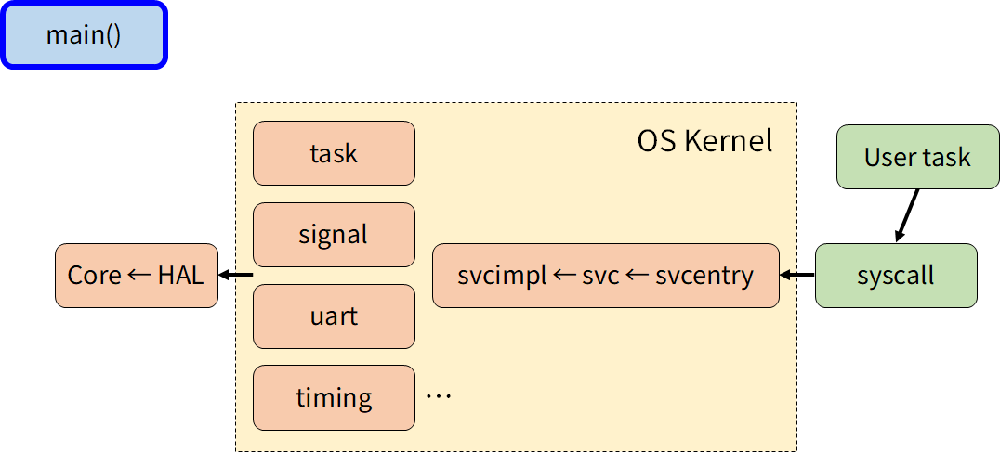
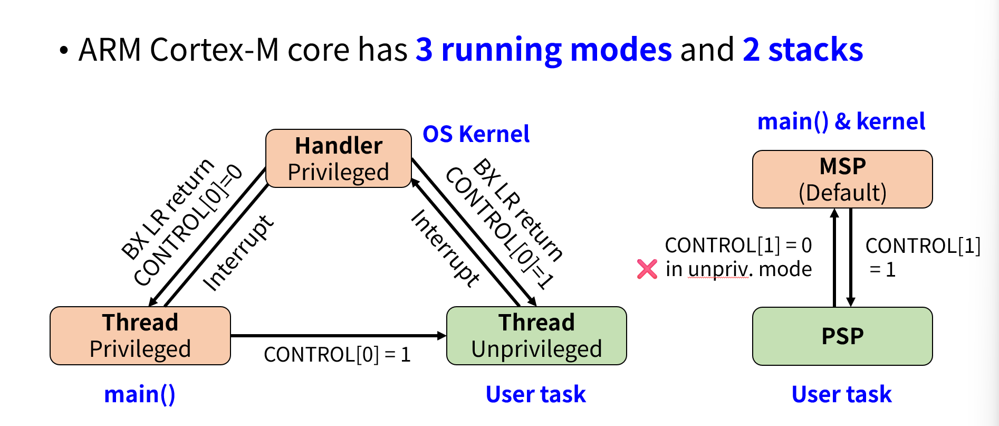
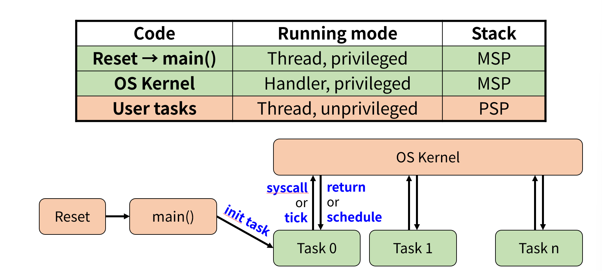
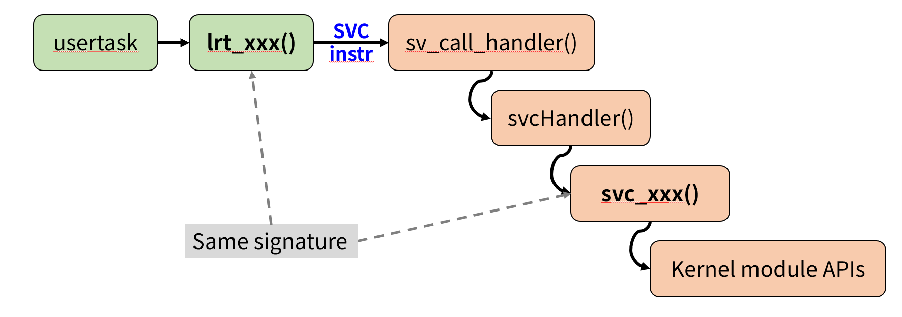
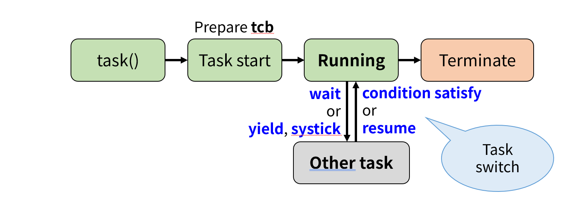

# LightRT from hezhiying

    声明： 我们的板子与所有构思内容，均是在本课程期间开始构思并最终完成，如果有疑问，可以查询github上面的会议记录，有完整录音和文字记录。https://git.lug.ustc.edu.cn/hzyosh/lightrt或者进行任何代码查重

- [LightRT from hezhiying](#lightrt-from-hezhiying)
  - [一、项目背景](#一项目背景)
  - [二、小组成员及分工](#二小组成员及分工)
  - [三、项目总览](#三项目总览)
    - [系统架构设计](#系统架构设计)
      - [可扩展性](#可扩展性)
      - [高性能](#高性能)
      - [易移植性](#易移植性)
    - [技术路线](#技术路线)
  - [四、架构介绍](#四架构介绍)
    - [代码构成](#代码构成)
    - [用户态与内核态](#用户态与内核态)
    - [系统调用](#系统调用)
    - [进程管理](#进程管理)
  - [四、创新技术实现](#四创新技术实现)
    - [1. 基于 STM32 的 Renode 开发环境搭建](#1-基于-stm32-的-renode-开发环境搭建)
    - [2. 模块化驱动设计](#2-模块化驱动设计)
    - [3. 言协作开发](#3-言协作开发)
    - [6. 系统调用、中断与异常处理](#6-系统调用中断与异常处理)
  - [五、回顾中期报告（及功能实现方式）](#五回顾中期报告及功能实现方式)
    - [中期目标](#中期目标)
    - [（一）已完成部分（具体详细介绍在前面已经部分展示）](#一已完成部分具体详细介绍在前面已经部分展示)
      - [1.默认抢占式多任务](#1默认抢占式多任务)
      - [2.提供局部实时realtime，方便有时序需求的任务](#2提供局部实时realtime方便有时序需求的任务)
      - [3.优先级控制](#3优先级控制)
      - [4.可以主动调度](#4可以主动调度)
      - [5.Shared memory传递大块数据](#5shared-memory传递大块数据)
      - [6.DMA协助处理大块数据](#6dma协助处理大块数据)
      - [7.中断](#7中断)
      - [8.外设硬件的抽象，为用户程序提供API](#8外设硬件的抽象为用户程序提供api)
      - [9.为用户进程输出调试信息](#9为用户进程输出调试信息)
    - [（二）增加部分](#二增加部分)
    - [（三）选择不做部分及其原因（不是不会做或者没时间做，是没有必要做）](#三选择不做部分及其原因不是不会做或者没时间做是没有必要做)
  - [六、项目未来可拓展方向](#六项目未来可拓展方向)
    - [1. 高级调度算法](#1-高级调度算法)
    - [2. 更多内核模块](#2-更多内核模块)
    - [3. 动态内存分配](#3-动态内存分配)
    - [4. 动态加载器](#4-动态加载器)
    - [5. 外部 MMU 支持](#5-外部-mmu-支持)
  - [七、总结](#七总结)
    - [项目总结](#项目总结)
    - [开发过程的感悟](#开发过程的感悟)
      - [团队协作](#团队协作)
      - [技术挑战与学习](#技术挑战与学习)
      - [设计决策](#设计决策)
  - [八、致谢](#八致谢)
    - [致谢](#致谢)
  - [参考文档](#参考文档)

## 一、项目背景

LightRT 是一个轻量级实时多任务操作系统（RTOS），专为 STM32F103 系列微控制器（ARM Cortex-M3 架构）设计。目标应用场景包括物联网（IoT）、工业控制和低功耗嵌入式系统。LightRT 通过分布式微控制器集群、共享 RAM 和高速通信总线实现高效的任务管理和数据交换，突破传统单核 RTOS 的性能瓶颈。系统采用宏内核架构，支持用户态和内核态隔离，强调低功耗、高实时性和模块化设计，完全基于开源工具链开发，托管于 USTC LUG GitLab（<https://git.lug.ustc.edu.cn/hzyosh/lightrt>）和 GitHub（<https://github.com/OSH-2025/hezhiying）。>

我们的设计理念是“简单代码，强大扩展性”，通过清晰的模块化设计和标准化的接口，降低学习曲线，适合嵌入式系统课程教学和开发者扩展。项目支持 STM32F103 的硬件特性（如 DMA、GPIO、UART），并通过 Renode 模拟器提供开发和测试环境。

## 二、小组成员及分工

| 姓名   | 学号       | 负责模块                                                     |
| ------ | ---------- | ------------------------------------------------------------ |
| 罗嘉宏 | PB23030713 | 内核服务、任务调度/切换，Docker 开发环境、Renode 模拟环境、目标硬件设计 |
| 崔卓   | PB23111687 | 内存管理、IO，负责 LightRT 内核开发、系统调用实现            |
| 位文康 | PB23111722 | 中断，通信接口，STM32F103 硬件初始化                         |
| 郭彦禛 | PB23030733 | 日志log、调试、设计高速 USART 协议和共享 RAM 数据交换        |

## 三、项目总览

### 系统架构设计

- #### 安全性

  - LightRT 通过严格的运行模式隔离机制（用户任务运行在非特权模式），确保用户代码无法直接访问关键硬件资源。
  - 所有敏感操作均需通过系统调用接口（SVC）进入内核态执行，由内核统一验证参数和权限，防止非法操作。
  - 内核模块中的数据结构采用静态对象，避免动态内存分配带来的不确定性风险。

  #### 可扩展性

  - 采用宏内核结构与模块化设计，核心功能包括任务管理、信号量、定时器、UART 通信等均可独立开发和维护。
  - 提供清晰的硬件抽象层（HAL），便于适配不同外设或芯片型号。
  - 支持自动代码生成工具 SVCC，简化新增系统调用时的重复编码工作。
  - 预留扩展空间，如未来支持文件系统、网络协议栈、I2C/SPI 驱动等。

  #### 高性能

  - 轻量级上下文切换机制：仅保存需要软件保存的寄存器（R4-R11），利用 PendSV 异常实现高效任务调度。
  - 基于优先级的任务调度算法，也支持抢占式和协作式调度策略，以及用户自定义的调度算法。
  - 使用 ARM Cortex-M3 的硬件特性（如 SVC 指令、PendSV 中断）减少软件开销，提升响应速度。
  - 所有底层操作直接使用 ARM 汇编编程，避免冗余抽象层带来的性能损耗。

  #### 易移植性

  - 硬件抽象层（HAL）将芯片初始化、中断控制、系统时钟、串口通信等功能封装，降低对特定平台的依赖。
  - 当前已支持 STM32F103ZGT6（ARM Cortex-M3 架构），具备良好的向其他 Cortex-M 系列芯片迁移的基础。
  - 利用开源库 libopencm3 实现标准化外设访问接口，进一步提高跨平台兼容性。
  - 开发环境通过 Docker 容器化部署，保证开发和构建环境一致性，简化跨团队协作与多平台编译流程。

### 技术路线

在技术选型方面，我们着重考虑了以下几点：

- **坚持使用 C 语言进行系统开发** ：尽管现代语言（如 Rust）在内存安全、并发模型等方面具有显著优势，但我们依然选择 C 作为 LightRT 的主要开发语言。其核心原因在于 C 具备极高的可移植性、广泛的硬件兼容性以及对底层寄存器的直接控制能力，非常适合嵌入式实时系统的开发。此外，C 语言能够保证与现有开源库（如 libopencm3）的无缝集成，从而降低开发成本并提升系统稳定性。
- **参考经典 RTOS 架构设计理念** ：LightRT 在设计过程中借鉴了多个轻量级实时操作系统的设计理念，包括 FreeRTOS 和 uC/OS 等。这些系统在任务调度、资源管理及中断处理机制方面的成熟经验为 LightRT 提供了坚实的技术基础。同时，LightRT 强调简化结构、模块化设计和用户/内核空间隔离，使其更适用于教学和小型嵌入式项目开发。
- **宏内核结构** ：通过宏内核结构将核心功能集中于内核空间运行，以减少上下文切换开销并提高系统响应速度。所有系统功能调用操作均需通过 SVC 指令进入内核态执行，确保系统安全性。

在我们的实际开发过程中，主要步骤如下：

1. **需求分析与架构设计** ：深入研究 STM32F1 系列 MCU 的硬件特性，并结合嵌入式实时系统的需求，明确 LightRT 的目标定位——轻量化、模块化、易于扩展。基于此，制定了清晰的系统架构图，明确了主控流程、任务调度机制、系统调用接口及硬件抽象层的设计方案。
2. **核心模块开发** ：
   - **任务管理模块** ：实现了任务创建、销毁、优先级调度及上下文切换机制，利用 PendSV 异常完成任务切换。
   - **系统调用模块** ：通过 SVC 指令实现用户态到内核态的安全切换，结合 SVCC 工具自动生成系统调用接口代码，极大提高了开发效率。
   - **时钟与定时器模块** ：基于 SysTick 实现系统滴答计数和延时功能，支持任务睡眠与唤醒机制。
   - **通信模块** ：实现 UART 基础串口通信功能，支持调试输出与用户交互。
   - **DMA**以及其他外设：根据HAL提供的接口完成相应功能，并对用户程序提供接口，方便调用和管理。
3. **系统集成与测试验证** ：完成各模块开发后，将其整合进完整系统，并通过仿真平台（Renode）进行多轮测试。测试内容涵盖基本任务调度、系统调用稳定性、异常处理完整性以及长时间运行的可靠性。同时，借助 GDB 调试工具进行问题追踪与优化，最终确保 LightRT 能够稳定运行在资源受限的嵌入式环境中。
4. **工具链与开发环境搭建** ：采用 Docker 容器化方式封装完整的交叉编译环境，确保团队成员拥有统一的开发体验。结合 Git 版本控制与 VSCode 远程开发插件，进一步提升了协作效率和工程管理的便捷性。

LightRT 采用多语言开发和开源工具链，技术栈如下：

- **编程语言**：
  - **C（69.8%）**：内核、硬件驱动和系统调用实现，满足实时性要求。
  - **C#（14.9%）**：开发 Renode 模拟器外设模型。
  - **C++（11.0%）**：实现通信协议栈和模块化组件，包含系统调用编译工具（`svccompile/svcc.cpp`）。
  - **ARM 汇编（2.3%）**：中断处理和上下文切换（如 `svcentry.c` 中的 SVC 处理）。
  - **Makefile（2.0%）**：自动化构建流程（`Makefile`）。
  
- **工具链**：
  
  - **编译器**：arm-none-eabi-gcc，交叉 GCC 编译器。
  - **调试器**：gdb-multiarch，支持多架构调试。
  - **硬件库**：libopencm3，部分提供 STM32F1 硬件抽象层（HAL）。
  - **模拟器**：Renode，支持 STM32F103 模拟，配置文件为 `simulate/stm32f103.repl` 和 `simulate/simulate.resc`。
  - **构建工具**：GNU Make 和 Docker，确保一致的开发环境（`Directory.Build.targets` 为 .NET 代码构建所需）。
  - **版本控制**：Git，托管于 LUG GitLab 和 GitHub。
  - **代码编写**：VSCode
  - **开发环境**：Docker + Makefile
  
  ## 四、架构介绍
  
  ### 代码构成
  
  
  
  - main() – C system entry
  
  ​    Called by **reset handler** in **hardware library** (libopencm3).
  
  - Initialize peripherals
  
    System clock
  
    UART controller
  
    Timing (systick)
  
  - Create first task
  
    **Task 0** (init) will further run other tasks
  
  ### 用户态与内核态
  
  
  
  
  
  ### 系统调用
  
  
  
  •System call switch to **kernel mode** [syscall.c]
  
  •Expose syscalls [syscall.h]
  
  •SVC enters kernel mode (Handler mode) [svcentry.c]
  
  •The SV call C handler [svc.c]
  
  •The SV call C implement [svcimpl.c] (目前采用模块化设计，分散到各个模块的文件中)
  
  ### 进程管理
  
  
  

## 四、创新技术实现

### 1. 基于 STM32 的 Renode 开发环境搭建

- 鉴于硬件开发环境的限制，我们搭建了一个基于Docker的模拟开发环境。（详见：<https://git.lug.ustc.edu.cn/luojh/stm32dev）>
- 为了提高仿真的准确性，我们自行实现了许多相关Renode外设，模拟真实的STM32行为，其对应准确性和硬件对应程度更加完善。
- 通过执行 `make` 命令，我们可以生成可烧录到开发板上的文件 `firmware.bin`。

### 2. 模块化驱动设计

- 基于 libopencm3 库构建模块化驱动，支持 GPIO、UART 和 DMA。
- `gpio.c`、`uart.c` 和 `dma.c` 提供标准化的硬件接口。
- 系统组件是模块化的，使得这些组件的重新开发，替换以及维护工作都可以非常方便地进行。

### 3. 言协作开发

- 使用 C# 进行Renode环境的构建。
- 使用 C++ 构建编译工具。
- 使用 C、ARM 汇编开发操作系统，兼顾性能与开发效率的优化。

### 6. 系统调用、中断与异常处理

- 我们在 `svc.h` 中定义了 30 个系统调用。
- 在 `svcentry.c` 和 `svcimpl.c` 中实现了 SVC 指令并处理系统调用。
- 由svcc自动生成相关代码，避免人工编写可能带来的错误。

## 五、回顾中期报告（及功能实现方式）

### 中期目标

1.多任务

- 默认抢占式多任务
- 通过FSMC外挂RAM的不同区域实现内存切换
- 提供局部实时realtime，方便有时序需求的任务
- 优先级控制
- 可以主动调度 

2.通信与同步

- 类Socket 消息传递
- Shared memory传递大块数据
- DMA协助处理大块数据 

3.实时功能

- 中断

4.外设

- 外设硬件的抽象，为用户程序提供API

5.调试

- 为用户进程输出调试信息。

### （一）已完成部分（具体详细介绍在前面已经部分展示）

#### 1.默认抢占式多任务

- 使用SysTick定时器（见 `main.c`中 `systick_set_*` 系列函数）定期产生中断，触发 `sys_tick_handler`（见 `task.c`）。
- 在 `sys_tick_handler` 中，遍历所有任务，处理等待超时、DMA完成等事件，并通过设置 `SCB_ICSR |= SCB_ICSR_PENDSVSET` 触发 PendSV 异常，实现任务上下文切换。
- 任务切换核心在 `pend_sv_handler`（`task.c`），保存当前任务上下文，选择下一个可运行任务，恢复其上下文，实现抢占式多任务。

#### 2.提供局部实时realtime，方便有时序需求的任务

- 任务可通过 `lrt_clock_delay`（对应 `svc_clock_delay`，见 `clock.svc.c`）进入定时等待，指定延迟tick数。
- 在 `sys_tick_handler` 中检测等待到期的任务，将其唤醒，保证有时序需求的任务能按时恢复运行，具备局部实时性。

#### 3.优先级控制

- 每个任务控制块（`tcb_t`，见` task.h`）有 `prio` 字段。
- 调度器 `sched_next`（`task.c`）在选择下一个任务时，优先选择优先级最高且处于 `TASK_NORMAL` 状态的任务，实现优先级调度。

#### 4.可以主动调度

- 任务可通过 `lrt_task_yield`（对应 `svc_task_yield`，见 `task.svc.c`）主动让出CPU，切换到指定或下一个任务。
- 任务也可通过 `lrt_task_terminate` 主动结束自身，调度器会切换到其他任务。

#### 5.Shared memory传递大块数据

- 通过 `svc_shmem_base、svc_shmem_size、svc_shmem_lock、svc_shmem_unlock`（见 `shmem.svc.c`）提供共享内存的基址、大小和互斥锁机制。
- 用户可直接访问外部共享内存，用于任务间大块数据传递。

#### 6.DMA协助处理大块数据

- 通过 `svc_dma_init、svc_dma_4byte、svc_dma_start、svc_dma_wait` 等接口（见 `dma.svc.c`），封装DMA初始化、配置、启动和等待。
- 任务可发起DMA搬运，自己进入等待，DMA完成后由调度器唤醒，或者继续执行并稍后检查DMA完成状态，提升大块数据搬运效率。

#### 7.中断

- 利用 Cortex-M 的中断机制（如 SysTick、USART、DMA等），在 `uart.c`、`dma.c` 等文件中实现外设中断服务函数（如 `usart1_isr`）。
- 中断服务例程可直接操作任务状态，实现事件驱动的任务唤醒和调度。

#### 8.外设硬件的抽象，为用户程序提供API

- 每类外设（如 UART、GPIO、DMA）均有独立的驱动文件（如 `uart.c、gpio.c、dma.c`），并通过 SVC 系统调用（如 `svc_uart_write、svc_gpio_led_set`）向用户程序提供统一API。
- 用户无需关心底层寄存器细节，直接调用API即可操作外设。

#### 9.为用户进程输出调试信息

- 提供 `uart_write、uart_printf` 等函数（见 `uart.c`），支持格式化输出。
- 用户任务可直接调用这些函数输出调试信息到串口，便于开发和调试。

### （二）增加部分

1. #### 内存管理

内存管理相关代码位于 `mm/` 目录，主要文件为 [mm.h](vscode-file://vscode-app/d:/Microsoft VS Code/resources/app/out/vs/code/electron-sandbox/workbench/workbench.html) 和 [mm.c](vscode-file://vscode-app/d:/Microsoft VS Code/resources/app/out/vs/code/electron-sandbox/workbench/workbench.html)。

主要结构体

- **memblk**：表示一个内存块，包含指针、大小和分配状态。
- **memctx**：表示整个内存池的上下文，包含内存池起始地址、总大小、内存块数组、当前块数和最大块数。

主要函数

- **mem_init**
  初始化内存池，将整个内存池作为一个未分配的块，并设置块描述符数组。
- **mem_alloc**
  遍历所有内存块，查找未分配且足够大的块。如果块大于请求大小且有空余块描述符，则拆分为已分配块和剩余空闲块。返回分配的内存指针。
- **mem_free**
  释放指定指针对应的内存块，并尝试与前后相邻的空闲块合并，减少碎片。
- **mem_dump**
  打印当前所有内存块的状态，便于调试。

2. #### GPIO

GPIO相关代码位于 `gpio/` 目录，主要文件为 `gpio.h`、`gpio.c` 和 `gpio.svc.c`。

主要接口

- **gpio_led_init(port, pin)**
  初始化指定端口和引脚为推挽输出模式，并使能对应端口时钟。
- **gpio_led_set(port, pin, on)**
  控制指定端口和引脚的电平，实现LED开关。

SVC接口

- **svc_gpio_led_init**
  系统调用接口，调用 `gpio_led_init`完成初始化。
- **svc_gpio_led_set**
  系统调用接口，调用 `gpio_led_set`控制LED状态。

### （三）选择不做部分及其原因（不是不会做或者没时间做，是没有必要做）

1. 通过FSMC外挂RAM的不同区域实现内存切换

现在是各个芯片可以通过fsmc访问其他片上的内存，同步通过外部设计进行处理。而且扁平化的内存结构在实际应用中可以完全接受；而且外挂内存不断切换，会导致数据完整性问题。

2. 类Socket 消息传递

不需要socket进行通信，因为我们有非常完善的串口通信机制，这完全可以适配一个简单的机器人系统，而且因为没有网络栈，所以目前socket没有必要。并且，在机器人中只要完成简单的收发信息即可，不需要通过一个外部交换机来通信。今后移植网络栈之后可以实现Berkeley Socket接口。

## 六、项目未来可拓展方向

•Advanced scheduling algorithms

•More kernel modules (communication, critical section, large memory management, filesystem, common peripheral like I2C, etc.)

•Dynamical memory allocation (stack, etc.)

•Dynamical loader (Executable Flash → RAM)

•External MMU (Paging, Cache, RDMA etc.)

### 1. 高级调度算法

为了提升任务调度的灵活性和效率，我们计划引入更高级的调度算法，以支持更复杂的应用场景和更高的实时性能。

- **多级反馈队列（MLFQ）**：实现多级反馈队列调度算法，通过动态调整任务优先级，根据任务的运行行为（如 CPU 使用率、等待时间）优化调度策略。这将提高系统的资源利用率，特别是在多任务混合负载的情况下。
- **抢占式优先级调度优化**：进一步优化现有的基于优先级的抢占式调度算法，减少调度延迟，确保高优先级任务的快速响应。同时，计划引入优先级反转保护机制（如优先级继承或优先级天花板），以避免低优先级任务阻塞高优先级任务。
- **调度策略抽象接口**：开发基于 Trait 的调度策略抽象接口，允许开发者根据具体应用需求自定义调度算法（如轮询调度、实时调度或其他混合调度策略），提高系统的灵活性和可扩展性。

### 2. 更多内核模块

为了增强 LightRT 的功能覆盖范围，我们计划扩展内核模块，新增以下功能模块，以支持更复杂的嵌入式系统需求。

- **通信模块**：扩展现有的通信层，增加对 I2C、SPI 和 CAN 等常见通信协议的支持，开发标准化的通信接口，方便设备间的互联互通。例如，支持 I2C 总线驱动以连接传感器和外设。
- **临界区管理**：引入更强大的临界区保护机制，如基于优先级的互斥锁（Mutex）或读写锁（Read-Write Lock），以提高多任务环境下的资源访问效率和安全性。
- **大容量内存管理**：优化现有内存管理模块，支持大容量内存的分配和回收，减少内存碎片，并提供更高效的内存分配算法，适用于需要处理大量数据的应用场景。
- **文件系统支持**：集成轻量级文件系统（如 LittleFS 或 FATFS），为嵌入式设备提供数据存储和管理的功能，支持 SD 卡和 Flash 存储的读写操作。
- **通用外设驱动**：开发更多通用外设驱动，如 ADC、DAC、PWM 和 RTC（实时时钟），以支持更广泛的硬件功能，满足不同应用场景的需求。

### 3. 动态内存分配

当前的 LightRT 使用静态内存分配策略，以保证确定性和稳定性。然而，为了支持更灵活的应用场景，我们计划引入动态内存分配功能。

- **动态栈分配**：为任务提供动态栈分配功能，允许在运行时根据任务需求调整栈大小，优化内存使用效率。
- **内存池管理**：实现高效的内存池管理机制，支持动态分配和回收内存块，并通过碎片整理算法减少内存碎片，提高长期运行的稳定性。

### 4. 动态加载器

为了支持更灵活的程序执行方式，我们计划开发一个动态加载器，将可执行文件从 Flash 动态加载到 RAM 中运行。

- **Flash 到 RAM 的动态加载**：实现一个轻量级动态加载器，支持将应用程序代码从 Flash 存储加载到 RAM 中执行，减少 Flash 的磨损并提高执行效率。
- **模块化程序支持**：允许开发者将应用程序分解为多个模块，按需加载和卸载，增强系统的模块化设计，适用于需要动态更新功能的场景，如固件升级。
- **加载器安全机制**：在动态加载过程中引入校验机制（如 CRC 或哈希校验），确保加载的可执行文件完整性和安全性，防止恶意代码注入。

### 5. 外部 MMU 支持

尽管 STM32F103 系列微控制器不原生支持内存管理单元（MMU），我们计划通过外部硬件或模拟机制实现类似 MMU 的功能，以提升内存管理和性能。

- **分页机制**：通过软件模拟或外部硬件支持实现分页功能，将内存划分为固定大小的页面，优化内存访问效率并支持虚拟内存管理。
- **缓存支持**：引入缓存管理机制，优化数据访问速度，特别是在处理大容量数据或高频访问场景时，显著提升系统性能。
- **远程直接内存访问（RDMA）**：探索在分布式系统中实现 RDMA 支持，通过高速通信总线（如 FSMC 或 CAN）实现节点间高效的数据交换，适用于多节点协同场景。
- **内存保护增强**：利用外部硬件或软件机制实现内存保护，防止任务越界访问或非法操作，进一步提高系统的安全性和可靠性。

## 七、总结

### 项目总结

LightRT 是我们团队基于 C 语言与 ARM 汇编实现的轻量级实时操作系统内核，专为 STM32F103 系列微控制器（ARM Cortex-M3 架构）设计，旨在为嵌入式开发者提供一个高效、安全、可扩展的系统平台。通过参考经典 RTOS 的设计理念并结合现代开发实践，我们在任务调度、内存管理、线程通信、中断处理和硬件抽象层等核心模块上实现了完整的功能，并在 Renode 模拟器中进行了充分验证。最终，LightRT 成功运行于 STM32F103ZGT6 平台，具备良好的稳定性和可移植性，为后续向其他 Cortex-M 系列芯片迁移打下了坚实基础。

### 开发过程的感悟

#### 团队协作

LightRT 的开发让我们深刻认识到团队协作的重要性。我们小组成员各司其职，分别负责内核服务层、内存管理、进程调度和中断管理等模块。通过 Git 版本控制系统，我们高效管理代码，避免冲突，并通过定期的会议和代码审查，确保每个模块的顺利集成和系统的整体一致性。这种协作方式不仅提高了开发效率，也让我们深刻体会到在团队中分工协作的重要性。

#### 技术挑战与学习

在技术方面，我们面临了许多挑战。其中一个显著的困难是 UART 和 DMA 在 Renode 模拟器中的验证问题。最初，我们发现 UART 无法正常触发，DMA 也无法通过模拟验证。这迫使我们深入研究 STM32F103 的硬件文档和 Renode 的模拟实现，经过多次调试和配置调整，修改了Renode的部分外设实现，最终解决了这些问题。这一过程不仅加深了我们对硬件和模拟器的理解，也提升了我们的问题解决能力。

学习新技能是另一个重要的收获。LightRT 的开发涉及多种技术，包括嵌入式 C 编程、ARM 汇编语言、Renode 模拟器的使用，以及 Docker 容器化的开发环境搭建。对于我们这些学生来说，这是一个全面提升技术能力的机会。我们不仅学会了如何编写高效的嵌入式代码，还掌握了如何使用模拟工具进行测试和调试，以及如何通过容器化确保开发环境的一致性。

#### 设计决策

在设计决策上，我们选择了 C 语言作为主要开发语言，主要是因为其在嵌入式系统中的高效性和广泛兼容性。尽管现代语言如 Rust 在安全性和并发模型上有优势，但 C 语言允许我们直接访问硬件资源，并与现有的开源库 libopencm3无缝集成。我们还选择了宏内核架构，减少上下文切换开销，提高系统响应速度，但这也带来了性能优化的需求。

## 八、致谢

### 致谢

1. **团队成员**：崔卓，罗嘉宏，郭彦禛，位文康
2. **指导老师**：衷心感谢邢凯老师在整个项目过程中给予的细致指导与建设性意见，为项目的顺利开展和持续推进提供了坚实保障。尤其感谢老师在课题选择、项目实施及最终答辩等关键阶段所提供的专业建议与资源支持，使项目得以高效推进并持续优化完善。

## 参考文档

- STM32F103x8/B Reference Manual (RM0008), STMicroelectronics, [STM32F103x8/B Reference Manual](https://www.st.com/resource/en/reference_manual/rm0008-stm32f101xx-stm32f102xx-stm32f103xx-stm32f105xx-and-stm32f107xx-advanced-armbased-32bit-mcus-stmicroelectronics.pdf)
  
  ARM Cortex-M3 Technical Reference Manual, ARM Limited, [ARM Cortex-M3 Technical Reference Manual](https://developer.arm.com/documentation/100165/0201/)
  
  libopencm3 User Manual and API Reference, libopencm3 Community, [libopencm3 User Manual and API Reference](http://libopencm3.org/docs/latest/html/)
  
  FreeRTOS Reference Manual: Real-Time Kernel for Embedded Systems, Richard Barry, [FreeRTOS Reference Manual](https://www.freertos.org/Documentation/RTOS_documentation.html)
  
  MicroC/OS-II: The Real-Time Kernel, Jean J. Labrosse, [MicroC/OS-II Documentation](https://www.micrium.com/rtos/kernels/)
  
  Renode User Manual, Antmicro, [Renode User Manual](https://renode.readthedocs.io/en/latest/)
  
  Docker Documentation, Docker, Inc., [Docker Documentation](https://docs.docker.com/)
  
  Embedded Systems Programming with ARM Cortex-M Microcontrollers, Joseph Yiu, [The Definitive Guide to ARM Cortex-M3 and Cortex-M4 Processors](https://www.elsevier.com/books/the-definitive-guide-to-arm-cortex-m3-and-cortex-m4-processors/yiu/978-0-12-408082-9)
  
  Pro Git, Scott Chacon and Ben Straub, [Pro Git Book](https://git-scm.com/book/en/v2)
  
  A Survey of Real-Time Operating Systems for Embedded Systems, Various (IEEE), [IEEE Xplore](https://ieeexplore.ieee.org/)
  
  AN2548 - Using the STM32F0/F1/F2/F4/Lx Series DMA Controller, STMicroelectronics, [AN2548 DMA Controller Application Note](https://www.st.com/resource/en/application_note/an2548-using-the-stm32f0f1f2f4lx-series-dma-controller-stmicroelectronics.pdf)
  
  STM32 Community and Embedded Systems Forums, [ST Community](https://community.st.com/), [Stack Overflow](https://stackoverflow.com/questions/tagged/embedded), [Reddit r/embedded](https://www.reddit.com/r/embedded/)
  
  LightRT Source Code and Meeting Records, [USTC LUG GitLab](https://git.lug.ustc.edu.cn/hzyosh/lightrt), [GitHub Repository](https://github.com/OSH-2025/hezhiying)
