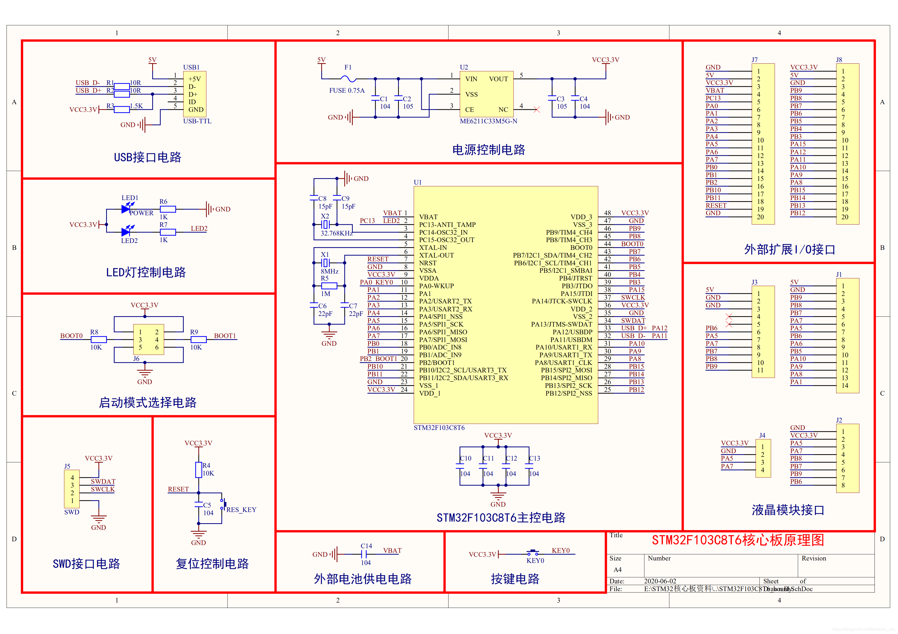
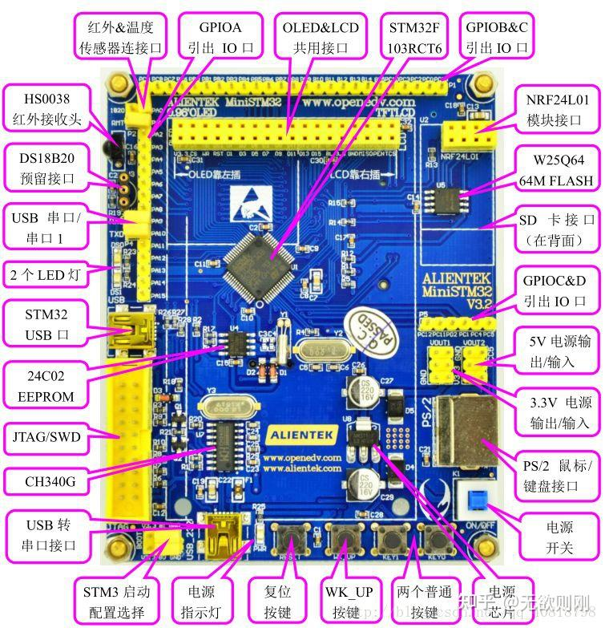
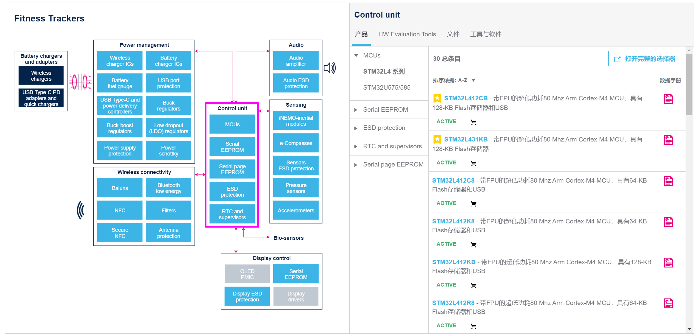
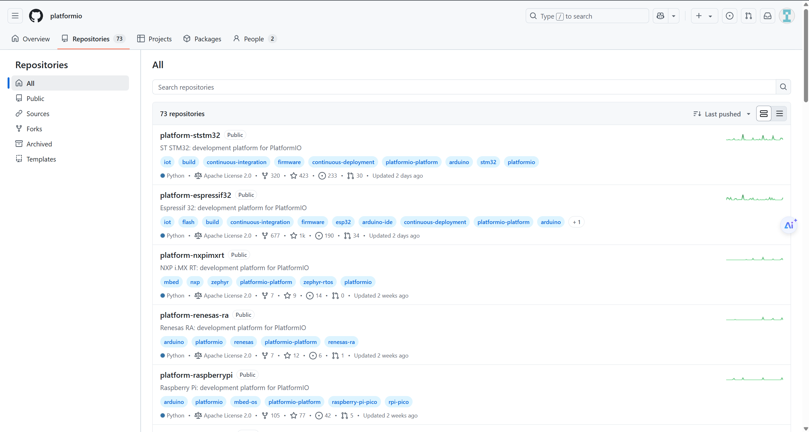
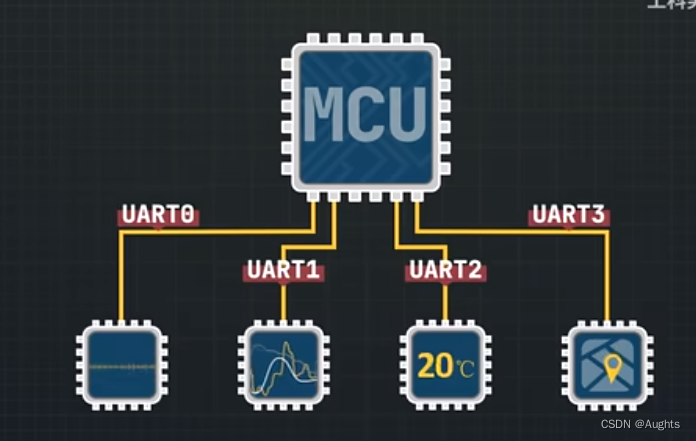
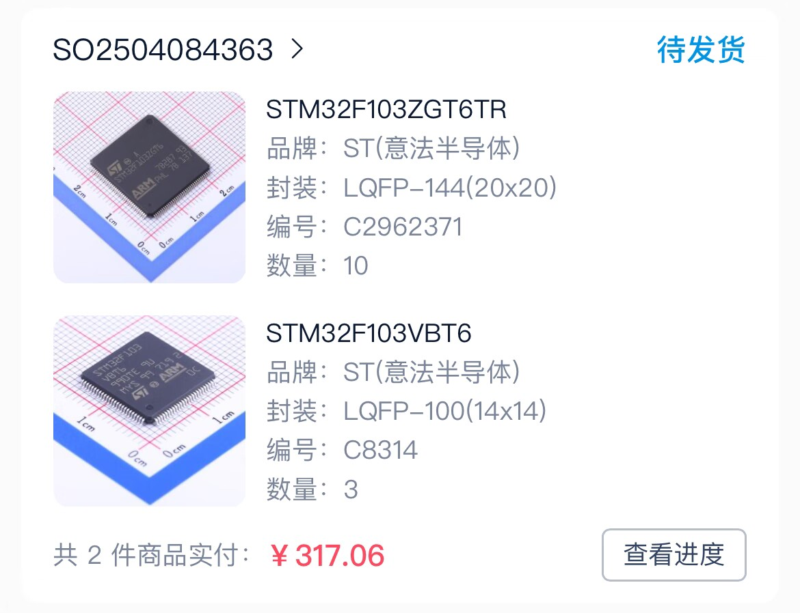

# **可行性报告**

## 目录

1. [**理论依据**](##一、理论依据)
   1.1 [**STM**](###1.STM)
   1.2 [**STM与OS**](###2.STM与OS)
   1.3 [**C源码到单片机**](###3.C源码到单片机)
   1.4 [**单片机之间的通信**](###4.单片机之间的通信)

2. [**技术依据**](##二、技术依据)
   2.1 [**实现流程**](###1.实现流程)

   - 2.1.1[**概述**](####1.1概述)
   - 2.1.2[**准备工作**](####1.2准备工作)
   - 2.1.3[**开发步骤**](####1.3开发步骤)

   2.2 [**主要功能描述**](###2.主要功能描述)

   - 2.2.1 [**概述**](####2.1概述)
   - 2.2.2 [**并行计算**](####2.2并行计算)
   - 2.2.3 [**USART 通信**](####2.3USART 通信)
   - 2.2.4 [**操作系统**](####2.4操作系统)

   2.3 [**硬件支持**](###3.硬件支持)

   - 2.3.1 [**STM购置**](####3.1STM购置)
   - 2.3.2[**代码托管平台**](####3.2代码托管平台)

3. [**创新点分析**](##三、创新点分析)
   3.1 [**应用场景**](###应用场景)
   3.2 [**模块化和可扩展设计**](###模块化和可扩展设计)
   3.3 [**低成本硬件**](###低成本硬件)
   3.4 [**自写操作系统和通信协议**](###自写操作系统和通信协议)
   3.5 [**快速原型开发**](###快速原型开发)

4. [**挑战**](##四、挑战)
   4.1 [**缺乏真正多核系统的性能**](###缺乏真正多核系统的性能)
   4.2 [**没有内存的保护模式 (protected mode)**](###没有内存的保护模式 (protected mode))

   4.3[**定制软件开发和测试工作量大**](###定制软件开发和测试工作量大)

   4.4[**通信和同步开销会影响性能**](###通信和同步开销会影响性能)

5. 

## 一、理论依据

### 1.STM

- **丰富的外设接口**：STM32 单片机支持多种外设接口和通信协议，例如 USB、CAN、SPI、I2C 等，方便与其他设备进行通信。串行通信接口有USART/UART，SPI，I2C。STM还有专用接口与扩展，如PWM，ADC/DAC。

  

- **易于调试和测试**：STM32 单片机配备了多种调试和测试接口，如 SWD 和 JTAG 接口，方便开发者进行调试和测试，这些调试工具都很便宜，有些单片机下载和仿真器都上千。还有就是STM32很多都是用keil开发工具。

- **更丰富的开发生态**：STM32有许多开源的开发工具和库，如CMSIS、HAL库等，可以加快开发时间和减少开发成本。

------

### 2.STM与OS

- **开源项目和支持** 对于STM32，有几个流行的开源RTOS可以选择：**FreeRTOS**：这是一个非常流行的实时操作系统，广泛应用于嵌入式系统。它具有小巧、可扩展性强的特点，并且针对STM32有良好的支持。**Zephyr Project**：由Linux基金会维护，Zephyr是一个模块化的轻量级RTOS，适合资源受限的设备。它支持多种架构，包括ARM Cortex-M系列，适用于物联网设备。**RIOT OS**：这是一个面向物联网的开源操作系统，强调低功耗和实时性。它同样支持STM32微控制器。**ThreadX**：虽然不是完全开源，但ThreadX现在是免费使用的，并且被微软收购后变得更加易于获取。它以其高性能和小尺寸而闻名。

------

### 3.C源码到单片机

- **开发环境**：我们决定自己写IDE进行代码的编译，可以参照已有的IDE进行我们自己的改进，**STM32CubeIDE**提供串行线查看器 (SWV) 跟踪功能、统计分析、实时操作系统识别，以及特殊功能寄存器 (SFR) 视图等高级调试特性。并且其具有经常更新并拥有活跃的论坛社区，我们可以从中获取技术支持和最新资讯。
- **编译代码**： 我们决定用参照STM32的交叉编译工具链，比如GNU Arm Embedded Toolchain，写一个自己的交叉编译工具。这个工具链将包括编译器、链接器、调试器等核心组件，以适应特定的嵌入式系统开发需求。我们将基于现有的开源工具链，结合STM32的硬件特性，定制编译选项、优化策略、库文件以及调试功能。
- **烧录代码到单片机**：连接开发板和电脑通过 ST-LINK ，其支持通过 USB 接口与开发板进行通信。加载编译生成的固件文件，然后将其传输到目标单片机的闪存中。ST-LINK 会自动识别目标设备的闪存区域，并将程序写入指定的存储区域。

------

### 4.单片机之间的通信

- **通信模型**：有线通信，通过物理导线传输数据，适用于稳定、高速的通信环境。抗干扰性强，传输稳定。典型协议: UART（通过 RS-232/RS-485）、SPI、I2C。
- **总线通信**：多个设备共享一条通信总线，通过设备地址或片选信号区分通信对象，易于扩展，适合连接多个设备，如2C 总线、CAN 总线。

------

------

## 二、技术依据

### 1.实现流程

#### 1.1概述

通过多个单片机之间的流式通信建立联系，使用单核cpu进行进程处理，使用函数实现信号和同步，使用多个API建立系统与用户之间的交互，用init程序执行用户写入的进程。

#### 1.2准备工作

- 购置STM32F103ZGT6TR十个与STM32F103VBT6三个用于单片机开发。
- 在服务器上部署armlab托管实验代码并且实现文件上传与自动编译和同步github

#### 1.3开发步骤

1. **写用户端API**

   - [docs/api/v1/list.md]: 在用户端实现与系统的交互，提供基础的进行创建与调度和进程通讯，并进行基础通信模式构建和环境搭建

   - 定义需要用到的API，并声明系统中应有的变量。

2. **系统与进程控制**

   - 系统自己拥有96K的内存，各自单片机拥有64K的内存进行处理。
   - 系统通过copy进程信息在不同进程之间切换，同时系统控制进程的挂起与终止。

3. **I/O**

   - 为各类硬件设备编写相应的驱动程序，并将硬件返回的数据格式化为系统可以处理的形式。
   - 设置缓冲区，当数据从设备读入或写往设备时，先在缓冲区中暂存，提升性能。
   - 对于支持中断机制的设备，需实现中断处理函数来响应设备发起的中断请求。通过这种方式，可以让系统及时得知外部事件的发生（例如用户按下按键），并作出相应处理。

4. **进程通信**
   - 用总线实现信息传输，并在函数中确定流式通信的方法与实现方式，完善com开头的函数。

5. **进程同步子系统**
   - 单片机环境下的任务切换往往依赖于硬件中断，所以同步机制必须能够在中断上下文中安全地运行。
   - 高优先级任务可能因为等待低优先级任务持有的资源而被阻塞，所以我们采用优先级继承协议。

------

### 2.主要功能描述

#### 2.1概述

使用多个 STM32F103 微控制器构建并行计算系统的可行性，目解决目前复杂的嵌入式系统（例如机器人比赛使用的机器人）中使用单个 MCU 无法完成真并行任务，而用 MPU / SoC 又极大增加复杂度的问题。该系统预计将通过使用 FSMC 的外部 RAM 支持多任务处理，通过 USART 支持高速通信，并通过自行开发的 C 语言操作系统进行任务管理。

#### 2.2并行计算

通过两级多任务分配，可以在多个 STM32F103 处理器上运行多个任务。

- 一级多任务（片内切换实现）：通过片内定时器控制的任务切换，实现伪多任务，这对于非实时任务而言是合适的。
- 二级多任务（多处理器）：多个处理器可以真正运行同时多任务。

#### 2.3USART 通信

STM32 处理器提供多个 USART，其中 USART1 最大可达 72MHz 通信速率，相当于近 9MByte/s，可以实现多个片间的消息传递。通过简单的数据包协议，可以对 USART 上的数据传输进行控制。多个 STM32 处理器共用外部的 USART Switch 实现数据包的自动转发。

#### 2.4操作系统

使用 C 语言编写简单的操作系统，实现下列功能：

- 多任务
    - 默认抢占式多任务
    - 通过 FSMC 外挂 RAM 的不同区域实现内存切换 (paging)
    - 提供局部实时 (realtime)，方便一些有时序需求的任务
    - 优先级控制
    - 可以主动调度
- 通信
    - 类 Socket 的统一消息传递机制，片内 & 片间
    - 共享内存传递大块数据
    - DMA 可以帮助处理大块数据
- 实时功能
    - 部分内部/外部中断转发给用户程序
- 外设
    - OS 实现外设硬件的抽象
    - 对用户程序提供 API

------

### 3.硬件支持

#### 3.1STM购置

目前已经购买13块以防涨价备用。

#### 3.2代码托管平台

在gitlab上部署了我们自己的平台，进行代码的自动化编译与代码同步。目前已经测试使用armlab。

------

## 三、创新点分析

1. ### 应用场景：

   - 该概念适用于需要分布式处理的中小型物联网项目。它适用于教育用途、业余爱好者项目和实验性物联网平台。

2. ### 模块化和可扩展设计：

   - **灵活性**：系统可以根据需求进行调整，添加或移除功能模块而不会影响其他部分的工作。
   - **易于维护**：模块化设计使得故障定位更加直接，便于维护和升级。

3. ### 低成本硬件：

   - **经济实惠的选择**：利用STM32等性价比高的单片机作为核心控制单元，搭配常见的传感器和通信模块，可以在不牺牲性能的前提下大幅降低硬件成本。
   - **广泛的可用性**：这类硬件在市场上广泛存在，容易获取，并且有大量的开源资源支持，对于教育机构和个人开发者来说非常友好。

4. ### 自写操作系统和通信协议：

   - 通过编写适合自己项目的操作系统和通信协议，可以根据具体需求对系统进行深度优化，提高效率并减少不必要的开销，且自定义协议允许在设计阶段就融入安全措施。

5. ### 快速原型开发：

   - 借助现有的开发工具链和丰富的库文件，开发者能够迅速构建起项目的原型，缩短从概念到实现的时间周期。
   - 这种敏捷开发模式非常适合实验性物联网平台，在早期阶段就能验证假设并根据反馈做出调整。

------

## 四、挑战

1. ### 缺乏真正多核系统的性能

   - **单核性能瓶颈**：大多数低成本STM单片机是单核处理器，在同一时间只能执行一个线程或进程，不能同时处理多个任务的应用。
   - **资源竞争加剧**：当多个高负载任务共享同一核心时，会导致CPU使用率过高，影响整个系统的响应速度和稳定性。

2. ### 没有内存的保护模式 (protected mode)

   - **系统稳定性风险**：由于没有内存保护模式，任意进程都可能意外地访问或修改其他进程的数据区域，导致系统崩溃或其他不可预见的行为。
   - **安全性降低**：对于安全性要求较高的应用，这种架构可能不够安全。

3. ### 定制软件开发和测试工作量大

   - **开发周期延长**：从零开始编写操作系统和通信协议意味着大量的前期开发工作，包括但不限于内核设计、驱动程序编写、API接口定义等，会延长项目的总体开发周期。

4. ### 通信和同步开销会影响性能

   - **带宽限制**：无论是采用无线还是有线方式进行节点间通信，都会存在一定的带宽上限，特别是在传输大量数据或频繁交换信息时，网络延迟和丢包现象可能会更加明显。
   - **同步机制消耗资源**：为保证数据一致性和操作顺序正确，必须引入各种同步机制，然而，这些机制本身也会占用宝贵的计算资源，并可能成为性能瓶颈。

------

## 五、参考文献

1. McKinney, C. J., & Balassiano, K. (2024). *Networked microcontrollers for accessible, distributed spatial audio*. ResearchGate. Retrieved from [https://www.researchgate.net/publication/386100637_Networked_microcontrollers_for_accessible_distributed_spatial_audio](https://www.researchgate.net/publication/386100637_Networked_microcontrollers_for_accessible_distributed_spatial_audio)

2. Zhang, Y., & Li, Z. (2015). *Distributed parallel computing with low cost microcontrollers for high performance electric vehicles*. In *2015 IEEE International Conference on Information and Automation* (pp. 2538-2543). IEEE. DOI: [10.1109/ICInfA.2015.7302257](https://ieeexplore.ieee.org/document/7302257)

3. Controllerstech. (n.d.). *Introduction to FreeRTOS in STM32*. Controllerstech. Retrieved April 10, 2025, from [https://controllerstech.com/introduction-to-free-rtos-in-stm32/](https://controllerstech.com/introduction-to-free-rtos-in-stm32/)

4. PCB Electronics. (n.d.). *Five embedded operating systems for STM32*. PCB Electronics. Retrieved April 10, 2025, from [https://www.pcbelectronics.com/contents/technologies/five-embedded-operating-systems-for-stm32](https://www.pcbelectronics.com/contents/technologies/five-embedded-operating-systems-for-stm32)

5. STMicroelectronics Community. (2023). *STM32 MCU capabilities with parallel processing*. STMicroelectronics Community Forum. Retrieved from [https://community.st.com/t5/stm32-mcus-products/stm32-mcu-capabilities-with-parallel-processing/td-p/50956](https://community.st.com/t5/stm32-mcus-products/stm32-mcu-capabilities-with-parallel-processing/td-p/50956)
