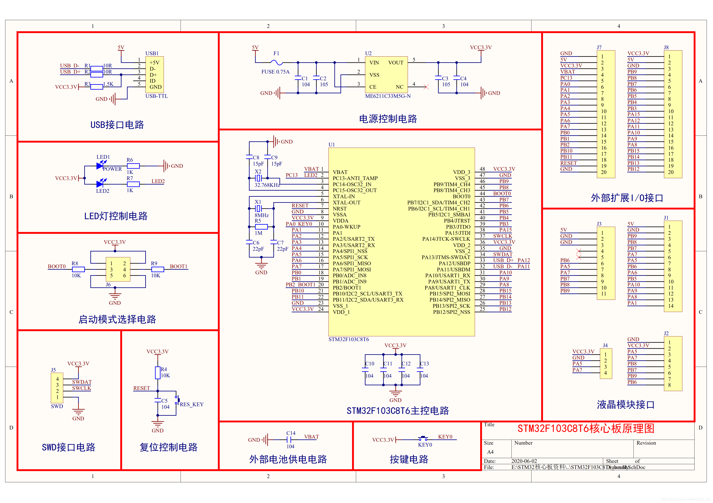
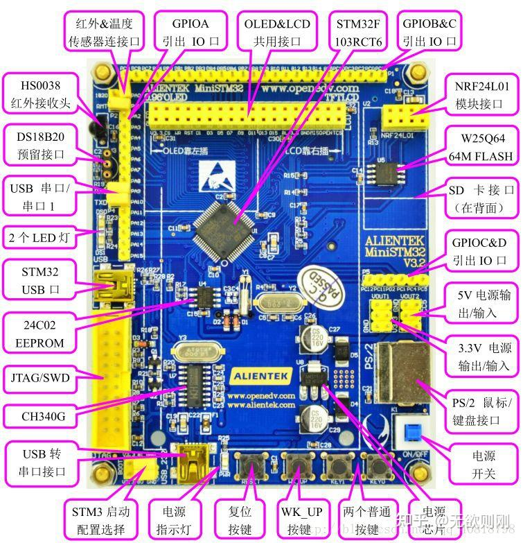
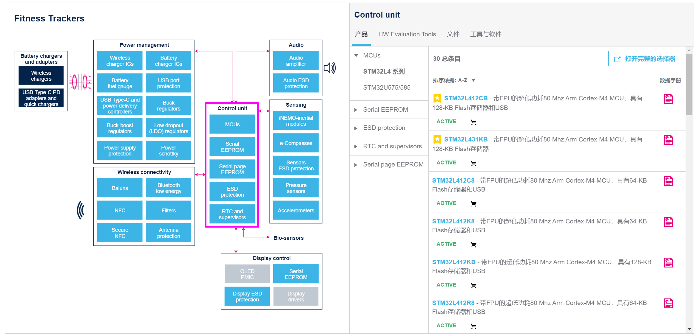
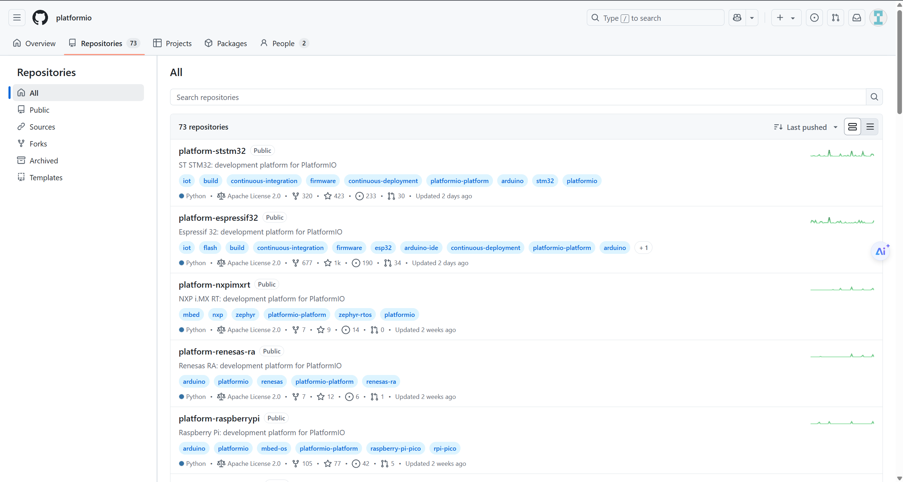
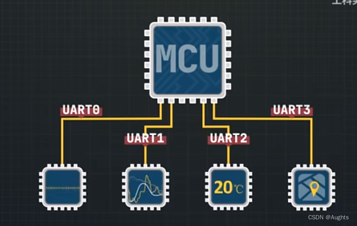

# **可行性报告**

## 一、理论依据

### 1. STM

- **丰富的外设接口**：STM32 单片机支持多种外设接口和通信协议，例如 USB、CAN、SPI、I2C 等，方便与其他设备进行通信。串行通信接口有USART/UART，SPI，I2C。STM还有专用接口与扩展，如PWM，ADC/DAC。

  

- **易于调试和测试**：STM32 单片机配备了多种调试和测试接口，如 SWD 和 JTAG 接口，方便开发者进行调试和测试，这些调试工具都很便宜，有些单片机下载和仿真器都上千。还有就是STM32很多都是用keil开发工具。

- **更丰富的开发生态**：STM32有许多开源的开发工具和库，如CMSIS、HAL库等，可以加快开发时间和减少开发成本。

------

### STM与OS

- **开源项目和支持** 对于STM32，有几个流行的开源RTOS可以选择：**FreeRTOS**：这是一个非常流行的实时操作系统，广泛应用于嵌入式系统。它具有小巧、可扩展性强的特点，并且针对STM32有良好的支持。**Zephyr Project**：由Linux基金会维护，Zephyr是一个模块化的轻量级RTOS，适合资源受限的设备。它支持多种架构，包括ARM Cortex-M系列，适用于物联网设备。**RIOT OS**：这是一个面向物联网的开源操作系统，强调低功耗和实时性。它同样支持STM32微控制器。**ThreadX**：虽然不是完全开源，但ThreadX现在是免费使用的，并且被微软收购后变得更加易于获取。它以其高性能和小尺寸而闻名。

------

### C源码到单片机

- **开发环境**：我们决定自己写IDE进行代码的编译，可以参照已有的IDE进行我们自己的改进，**STM32CubeIDE**提供串行线查看器 (SWV) 跟踪功能、统计分析、实时操作系统识别，以及特殊功能寄存器 (SFR) 视图等高级调试特性。并且其具有经常更新并拥有活跃的论坛社区，我们可以从中获取技术支持和最新资讯。
- **编译代码**： 我们决定用参照STM32的交叉编译工具链，比如GNU Arm Embedded Toolchain，写一个自己的交叉编译工具。这个工具链将包括编译器、链接器、调试器等核心组件，以适应特定的嵌入式系统开发需求。我们将基于现有的开源工具链，结合STM32的硬件特性，定制编译选项、优化策略、库文件以及调试功能。
- **烧录代码到单片机**：连接开发板和电脑通过 ST-LINK ，其支持通过 USB 接口与开发板进行通信。加载编译生成的固件文件，然后将其传输到目标单片机的闪存中。ST-LINK 会自动识别目标设备的闪存区域，并将程序写入指定的存储区域。

------

### 单片机之间的通信

- **通信模型**：有线通信，通过物理导线传输数据，适用于稳定、高速的通信环境。抗干扰性强，传输稳定。典型协议: UART（通过 RS-232/RS-485）、SPI、I2C。
- **总线通信**：多个设备共享一条通信总线，通过设备地址或片选信号区分通信对象，易于扩展，适合连接多个设备，如2C 总线、CAN 总线。

------

------

## 二、技术依据