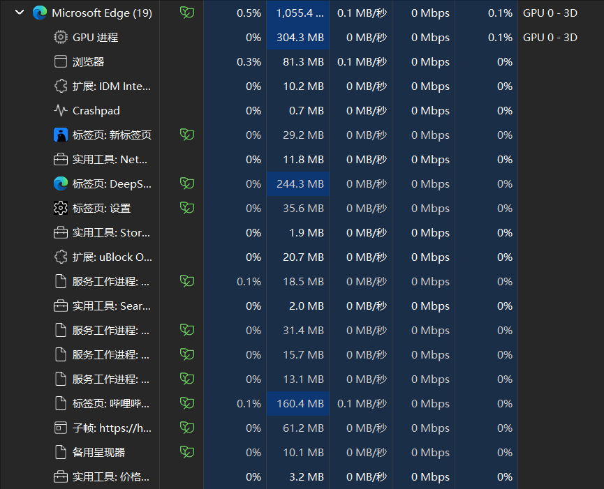

# OSH 前期个人调研报告

## Chromium 内核轻量化定制与内存管理优化

### 一、 构思来源

-   每次看到任务管理器里面 edge 庞大的进程数与内存占用都令人望而生畏，因此萌生了裁剪与重写 chromium 内核的想法

    

### 二、 任务分析

#### Chromium 内核的轻量化定制通常有两个步骤

-   裁剪现有模块：移除非核心功能（如 WebRTC、PDF 阅读器、媒体播放器等），通过修改 `gn` 构建文件禁用或删除相关代码模块。

-   重写部分组件：对进程管理、内存优化、渲染流程等方面进行代码重构。

#### 任务概述

-   通过编译参数禁用非核心模块，快速减少代码体积。

    -   步骤举例：

        类似于编译 Linux 内核时的 `menuconfig` ，修改 `args.gn` 文件：在 `src/out/Default` 目录下创建或编辑 `args.gn`，添加裁剪参数：

        ```gn
        enable_pdf = false
        enable_webrtc = false
        enable_extensions = false
        enable_printing = false
        ```

        生成构建配置：

        ```bash
        gn gen out/Default
        ```

        编译并验证：

        ```bash
        autoninja -C out/Default chrome
        ```

-   修改源码实现进程数限制和内存管理优化

    -   步骤举例：

        减少进程数：修改 `src/content/public/common/content_switches.cc`，添加进程数限制参数：

        ```cpp
        const char kRendererProcessLimit[] = "--renderer-process-limit=4";
        ```

        在 `src/chrome/browser/chrome_main.cc` 中注入命令行参数：

        ```cpp
        command_line->AppendSwitchASCII(switches::kRendererProcessLimit, "4");
        ```

        优化内存分配：修改 `src/base/allocator/partition_allocator/partition_alloc_config.h`，调整内存池大小：

        ```cpp
        #define PA_THREAD_CACHE_SIZE_KB 128
        ```

-   功能验证与调试

    -   功能测试：

        可以使用 Web Platform Tests 验证 Web 标准兼容性。

    -   性能测试：

        内存占用：对比裁剪前后 `chrome://memory` 数据。

        进程数：通过 `chrome://process-internals` 检查实际进程数。

    -   调试工具：

        使用 `gdb` / `lldb` 调试崩溃问题。

        通过 `chrome://tracing` 分析性能瓶颈。

#### 工具

`chrome://net-internals`：网络请求分析。

`chrome://blink-internals`：Blink 引擎状态监控。

### 三、 工作量与可行性分析

AI 告诉我说至少 2000 行代码以上，确实有些庞大了 hhh，主要是读 Chrome 内核代码真的是一项极其艰苦的工作，再深入改的话就更麻烦了。
