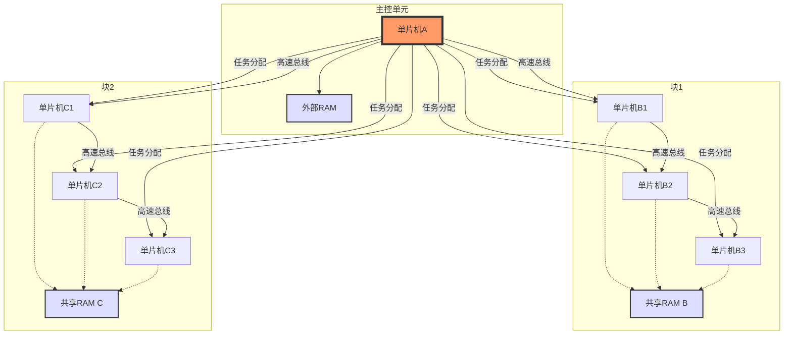

# 关于新选题的调研报告，一点思考，以及一些资料

## 一点思考

目前确定的选题是想进行多核的单片机进行控制。
目前已经有很多项目对于单片机的多进程控制有所研究，并且比较成体系化了，包括一些实时操作系统（RTOS）,比如 FreeRTOS 和 Zephyr Project，

关于RTOS

### 实时操作系统（RTOS, Real-Time Operating System）是一种专门设计用于管理硬件资源并提供多任务处理能力的操作系统，特别适用于需要严格时间约束的应用场景。与通用操作系统不同，RTOS 更注重响应时间和确定性行为，确保关键任务能在规定的时间内完成。

-   实时操作系统的特性
    -   实时性
        -   硬实时：系统必须在特定的时间限制内完成任务，否则可能导致严重后果（如安全问题）。例如，在航空电子设备或医疗设备中。
        -   软实时：虽然希望任务按时完成，但偶尔的延迟不会导致灾难性结果。例如，在多媒体应用中。
    -   任务调度
        -   优先级调度：每个任务被赋予一个优先级，高优先级的任务会优先执行。
        -   时间片轮转：如果多个任务具有相同的优先级，则按时间片轮流执行。
        -   抢占式调度：当前正在运行的任务可以被更高优先级的任务中断，并让后者立即执行。
    -   低资源占用
        -   RTOS 通常设计为轻量级，占用较少的内存和处理器资源，适合嵌入式系统等资源受限环境。
    -   可预测性
        系统的行为和响应时间是可以预测的，这对于需要精确控制的应用至关重要。
    -   同步机制
        提供信号量、互斥锁、消息队列等工具，帮助开发者管理任务间的通信和同步。
    -   中间件支持
    许多 RTOS 提供了丰富的中间件支持，如文件系统、网络协议栈、USB 支持等，方便开发复杂应用。
    

    但是对于这些RTOS，虽然给了我们比较轻量化的，实时的进程控制系统，但是对于多个单片机核心，目前并没有比较成熟的体系供我们使用。我们想做的就是

### 设计一个基于单片机集群的分布式系统，通过高速总线连接多个单片机，并利用共享 RAM 和一个控制核心来实现多任务处理和多进程控制。

关于其中关系示意图大概如下：

## 一些具体的操作

### 1.硬件选择

-   单片机选择:
    -   推荐使用支持高速通信接口的单片机，例如 STM32 系列（支持 CAN、SPI、I2C 等高速总线）、ESP32（支持 Wi-Fi 和多核）、或者 NXP 的 i.MX RT 系列。
    -   主控单片机需要较高的计算能力和内存管理能力，建议选择带 MMU（内存管理单元）或至少支持 RTOS 的型号。
-   高速总线:
    -   SPI: 速度快（几十 Mbps），适合短距离通信，可用于主控与从控之间的数据交换。
    -   CAN: 可靠性高，适合工业场景，支持多主多从架构。
    -   Ethernet: 如果需要更高带宽和扩展性，可以考虑以太网控制器（如 W5500 芯片配合单片机）。
    -   自定义总线: 如果现有总线不满足需求，可以基于 FPGA 实现自定义高速通信协议。
-   共享 RAM:
    -   使用外部 SRAM 或 DRAM 芯片（如 ISSI 的 IS61LV25616AL 或 Micron 的 DRAM），通过 FSMC（灵活静态存储器控制器，常见于 STM32）或类似接口连接到总线。
    -   主控单片机通过总线仲裁机制（如信号量或锁）管理 RAM 访问。

### 2.系统分块

-   将单片机群分为若干“块”，每个块内通过共享 RAM 实现数据交换，主控单片机负责跨块任务调度。
-   每个块内的从控单片机可以独立运行子任务，主控通过总线分发任务并收集结果。
-   考虑使用“主-从”架构，主控为 Master，从控为 Slave。

### 3.任务分配与多任务处理

-   主控单片机: 运行实时操作系统（RTOS，如 FreeRTOS 或 uC/OS-III），负责任务调度、资源管理和通信协议。
-   从控单片机: 可以运行轻量级 RTOS 或裸机代码，接收主控分配的任务并执行。
-   多进程控制: 在主控上实现类似操作系统的进程管理，通过共享 RAM 传递任务参数和结果。

### 4.通信协议

-   定义一个简单的通信协议，用于任务分配和状态反馈。具体待定，等到具体完成代码时再商议。
-   使用中断机制提高通信效率，避免轮询浪费 CPU 资源。

## 具体实现步骤

### (1)硬件连接

-   主控单片机通过 SPI/I2C/CAN 连接到从控单片机。
-   共享 RAM 通过 FSMC 或 GPIO 模拟总线连接到所有单片机。
-   添加必要的电源管理和信号隔离（如光耦或电平转换器）。

### (2) 软件设计

-   主控端:
    -   初始化 RTOS，创建任务调度器。
    -   实现总线通信驱动（如 SPI 驱动）。
    -   设计任务分配算法（例如基于优先级或负载均衡）。
-   从控端:
    -   初始化通信接口，监听主控指令。
    -   执行分配的任务并通过共享 RAM 返回结果。
-   共享 RAM 管理:
    -   实现简单的内存分配表，记录每个块的 RAM 使用情况。
    -   使用互斥锁防止数据竞争。
