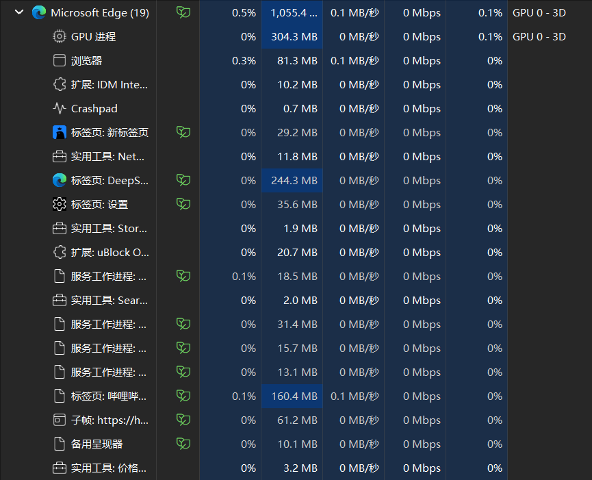

# OSH Preliminary Personal Research Report
[中文](investigation_cn.md) [英文](investigation.md)
## Lightweight Customization of Chromium Kernel and Memory Management Optimization

### I. Source of Ideas

- Every time I see the large number of processes and memory usage of edge in the task manager, it is daunting, so I came up with the idea of trimming and rewriting the Chromium kernel.

    

### II. Task Analysis

1. The lightweight customization of the Chromium kernel usually involves two steps:

- Trim existing modules: Remove non-core features (such as WebRTC, PDF reader, media player, etc.), and disable or delete related code modules by modifying the `gn` build file.

- Rewrite some components: Code refactoring is performed on aspects such as process management, memory optimization, and rendering process.

1. Task Overview

   - Disable non-core modules through compilation parameters to quickly reduce code size.

        - Example Steps:

            Modify the `args.gn` file: Create or edit the `args.gn` in the `src/out/Default` directory and add trimming parameters:
            ```gn
            enable_pdf = false
            enable_webrtc = false
            enable_extensions = false
            enable_printing = false
            ```

            Generate build configuration:
            ```bash
            gn gen out/Default
            ```

            Compile and verify:
            ```bash
            autoninja -C out/Default chrome
            ```

    - Modify the source code to implement process number limitation and memory management optimization

        - Example of steps:

            - Reduce the number of processes: Modify `src/content/public/common/content_switches.cc` , add process number limitation parameter:
                ```cpp
                const char kRendererProcessLimit[] = "--renderer-process-limit=4";
                ```
                Inject command-line parameters in `src/chrome/browser/chrome_main.cc` :
                ```cpp
                command_line->AppendSwitchASCII(switches::kRendererProcessLimit, "4");
                ```

            - Optimize Memory Allocation:Modify `src/base/allocator/partition_allocator/partition_alloc_config.h` , adjust the memory pool size:
                ```cpp
                #define PA_THREAD_CACHE_SIZE_KB 128
                ```

    - Function Verification and Debugging

        - Function Testing:

            Use Web Platform Tests to verify Web standard compatibility.

        - Performance Testing:

            Memory Usage: Compare the data before and after cropping at `chrome://memory`. 
            Process Count: Check the actual number of processes through `chrome://process-internals`.

        - Debugging Tools:

            Use `gdb`/`lldb` to debug crash issues. 
            Analyze performance bottlenecks through `chrome://tracing`.

2. Tools

- `chrome://net-internals`: Network request analysis.
- `chrome://blink-internals`: Blink engine status monitoring.

### III. Workload and Feasibility Analysis

- AI told me that there are at least 2000 lines of code, which is indeed quite large, haha. This plan was rejected as soon as it was proposed, a little bit hilarious. The main reason is that reading code is an extremely arduous task, and it will be even more trouble if we make any changes.
