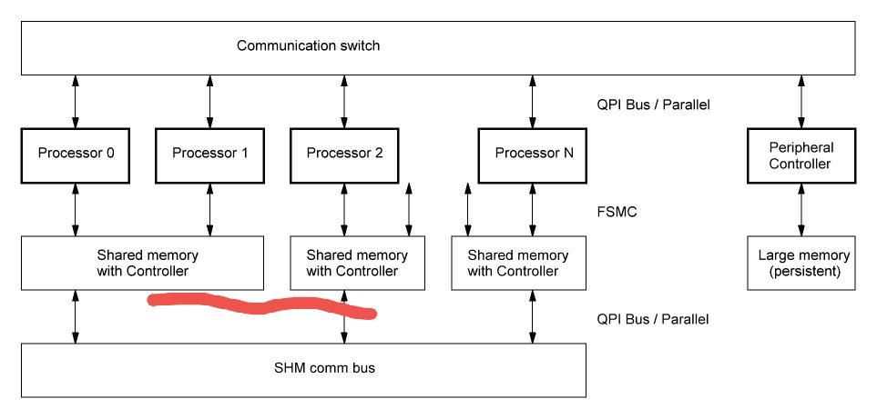

# OSH 调研报告和计划

嵌入式系统广泛使用于各类设备中，而它们通常只有一个处理器核心，也一般只运行一个任务。为了运行多个任务，最原始的方式是使用中断来打断主线程的运行，实现对突发事件的处理。在定时器中断的基础上，有一系列的嵌入式 OS，可以实现伪 (通过调度的) 多任务。而我们计划为了满足机器人等等设备的需求，设计一个包含多处理器且每个处理器上可以运行多任务的计算系统，以及所需的 OS 软件。其结构如下：

图中，Processor 0 .. N 是组成系统的多个处理器，使用 ARM 架构的单片机，通常具有 ~500KB 的 Flash 存储器和 ~64KB 的 RAM。

对于传统的片间消息传递需求，使用了位于顶部的 Communication switch，处理各 Processor 之间的消息接收和转发。

相邻的两个处理器除了可以直接发送消息，大块的数据还可以通过共享存储器进行交换。这是由于，FSMC 控制器可以将外部的 RAM 存储器映射到地址空间上的一块特定区域，可以用程序直接访问。

为了实现两个处理器的存储器共享，还需要加入读/写控制器，对读/写共享存储器的事件进行裁决。所有的读/写控制器通过高速 SHM comm bus 连接以实现共享存储器之间的数据复制等需求，类似 DMA，不需要应用处理器花费时间处理。

通过这样的结构，多个处理器之间可以完成调度/切换、动态加载程序 (处理器支持在 RAM 中 in-place 执行)、消息传递和共享内存等功能，可以满足较复杂的实时控制需求。

OS 需要包括下面的功能：

- 任务加载：从 Flash 中加载，或者从 RAM 动态加载并运行。
- 调度：任务切换、上下文保存和任务在处理器之间的迁移，处理任务优先级和中断。
- 内存管理：对片内、片外(共享)内存，以及片外大 persistent 存储器进行管理。
- 通信：片间通过传统消息通信，或者通过共享内存传递数据。
- 外设控制：控制片外设备，如 IO、网络控制器等设备。