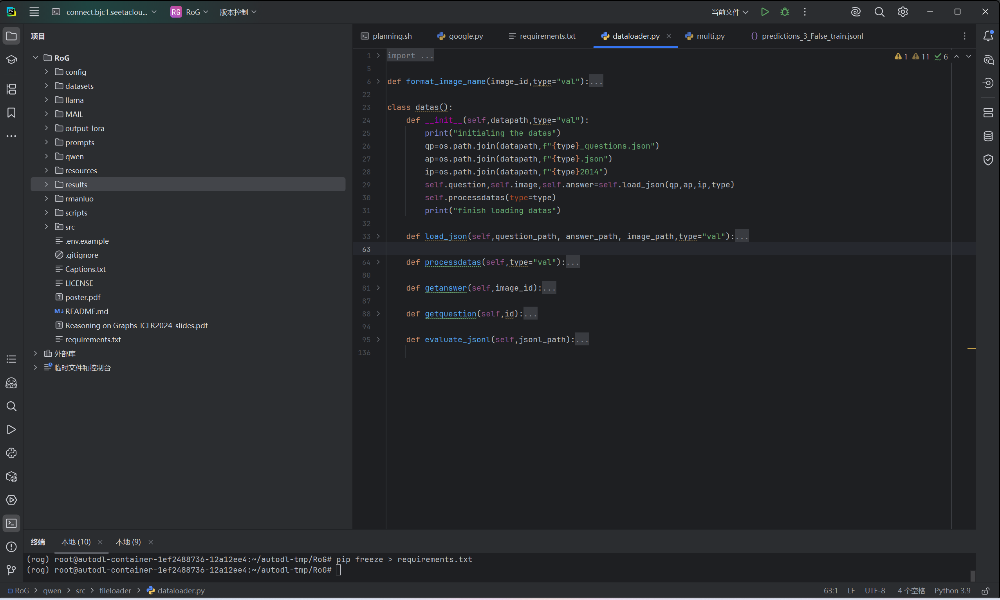
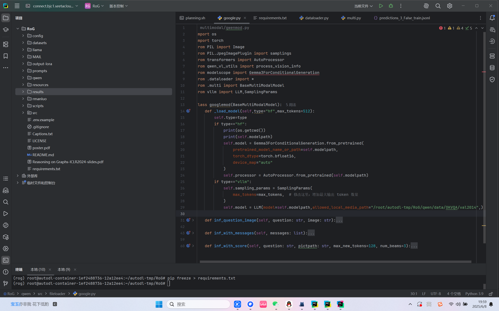
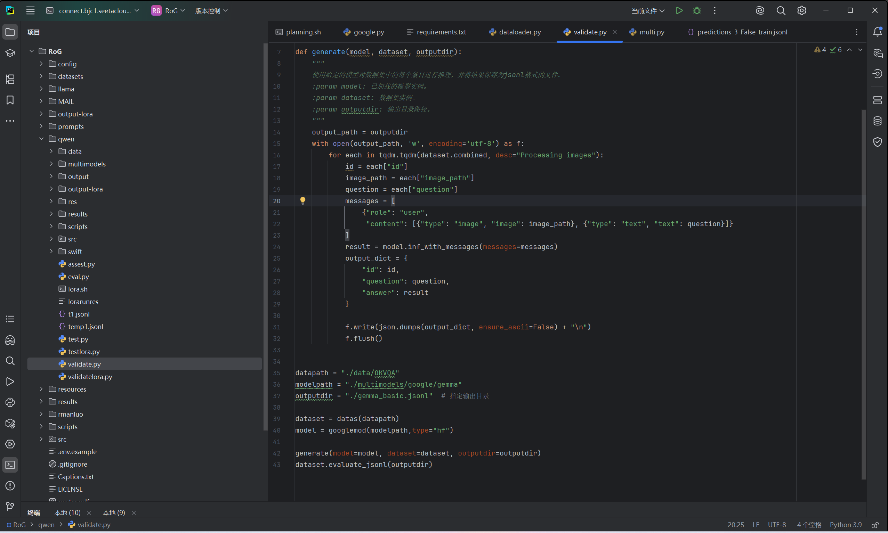
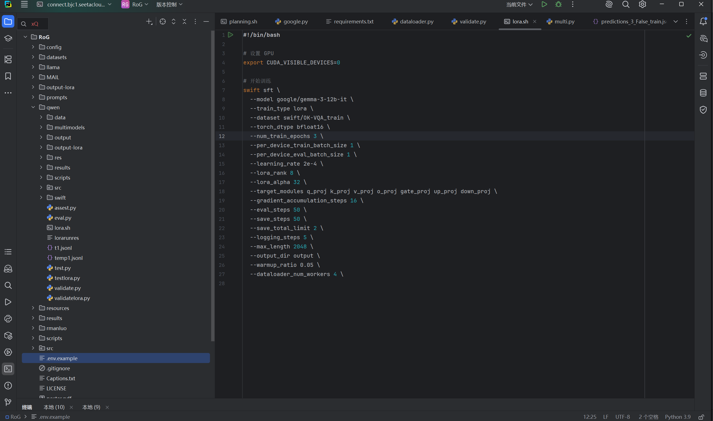

# 部署大模型文档
## 部署模型包括
本次lab4部署的大模型采用的是huggingface架构下的大模型，总共使用了三个基座模型进行测试，包括
    
- [Qwen/qwen](https://modelscope.cn/models/Qwen/Qwen2.5-VL-7B-Instruct)
- [google/gemma-3-12b-it](https://modelscope.cn/models/google/gemma-3-12b-it)
- [LLM-Research/Llama-3.2-11B-Vision-Instruct](https://modelscope.cn/models/LLM-Research/Llama-3.2-11B-Vision-Instruct)

三者是占用显存约25G的多模态大模型。可以对文本图片视频等其他格式进行处理。

## 部署过程
对于部署，首先使用魔搭社区提供的api进行模型本体文件的下载，阿里提供的镜像网站下载速度较快而且不受大部分对中科大的限制，可以比较容易的获取对应的license

接着配置环境，由于使用的是huggingface框架下的大模型，所以对transformer库是刚需的。除此之外还有torch套装，还有modelscope,为了显存负载还有flash_attention,vllm,deepspeed,等等，还有阿里提供的swift库用来集成几个模型的调用。具体的环境配置被我放在了:

[requirments](environment)

## 数据集
为了测试三个多模态大模型的效果，我们选择了经典的OKVQA数据集，使用的是COCO的图片集(但是缺点是label有点屎了,总体用下来感觉效果没有那么好，而且答案都很简单)

其中训练集包括9009个数据，测试集包括5046个数据，全部是以question-image-answer的形式给出。

数据集链接：[OKVQA](https://modelscope.cn/datasets/OmniData/OK-VQA)
## 数据集以及模型预封装
在一开始并没有选择使用vllm框架，transformer给出的基本api已经足够使用，但是后来在对gemma模型进行大型数据集上的推理测试时发现了时间长达20小时以上的，并且显存只占用了60%的时候。还是决定使用vllm对程序进行加速。

首先由于多模态数据集特色（自由自在的特色，每个数据集有自己的想法，不像单一文本模态那样统一），我首先定义了一个datas类作为加载数据集的专有类，可以通过选择的不同加载对应的数据集的内容。

然后定义了一个multi类作为三个大模型加载的父类，并分别定义了qwenmod,googlemod和llamamod作为三个处理三个模型的子类。分别有
- inf：接受数据集作为参数并返回模型预测结果
- inf_with_message：接受一个chat的template类型的message作为参数并返回预测结果
- inf_image_question:接受图片路径和问题字符串并返回预测结果
- inf_with_score:采用束推理的方式，一次生成多个答案，并返回对应的答案的结果以及正则化后的得分。

此处给出部分代码截图，具体代码请访问我的github来查看详细信息。

除此之外，由于transformer和qwen,gemma等几个模型的束搜索不兼容，因此还需要修改transformers/generation/utils.py

修改这一行（约第 4234 行）：processed_score[batch_group_indices] = next_token_scores_processed修改为processed_score[batch_group_indices] = next_token_scores_processed.to(processed_score.dtype)
## 离线推理
本次实验全程使用离线推理的形式进行测试，并对三个模型在OKVQA数据集上进行了测试。
其中对于基座模型在数据集上进行基准测试的示例代码如下（以google/gemma模型的在val验证集上的效果进行测试为例）

并且使用了swift模块对三个模型在训练集上进行了lora的微调，并merge lora后在验证集上进行了测试。

除此之外，我采用了多模态实体路径的方式对模型进行了测试以及特化性训练，其中先通过模型对具体训练集进行束搜索，关系路径生成以及对应结果预测，并整理上述结果为新的数据集反向喂给模型进行lora微调，然后在测试集上进行基准测试。

